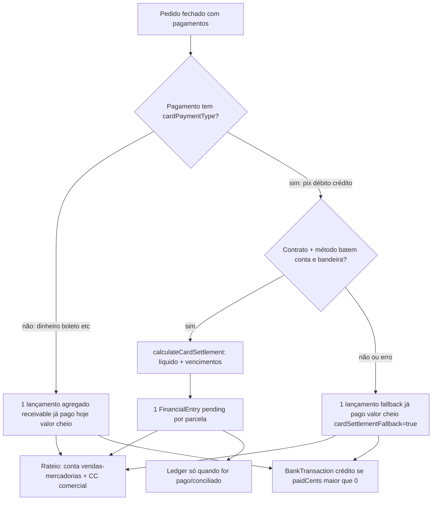
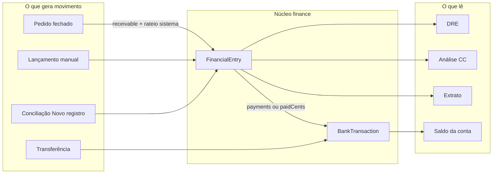

# Relatório — Módulo de Finanças do ERP

**Data:** 2026-08-18  
**Escopo:** `apps/erp` (web `:3107` + api `:3114`)  
**Fonte:** código atual (não só `AGENTS.md` / `GUIA.md` — alguns desses docs estão defasados; ver §18)

---

## 1. Veredito

O financeiro do ERP **não é mock**. É um módulo ponta a ponta, organization-scoped, em Clean Architecture na `erp-api` (`src/modules/finance/`) e telas MUI no `erp-web` (`src/features/*` + rotas `/financas/*`).

O coração é o **lançamento financeiro** (`FinancialEntry`): unifica contas a pagar e a receber. Em volta dele giram cadastros (plano, grupos, centros, contas, cartões, formas de pagamento), o **livro-razão bancário** (`BankTransaction`), **transferências**, **conciliação OFX**, **DRE** e **análise por centro de custo**. Vendas fechadas geram recebíveis automaticamente (motor de cartão/Pix).

Ainda são placeholder no menu Finanças: **Boletos** e **Contabilidade**. Facilita NF-e vive no menu, mas fala com `fiscal-api`, não com `finance`.

---

## 2. Onde vive

```
Operador
  → erp-web (:3107)
      React Query → fetch same-origin /api/proxy/comercio/v1/...
  → BFF do próprio Next (injeta JWT + X-Organization-Id)
  → erp-api (:3114)
      AuthGuard + PermissionGuard
      FinanceModule (10 submódulos Clean Architecture)
  → Postgres schema `erp` (banco citybox_platform)
      + MinIO (anexos de lançamento e arquivo OFX)
```

Tudo é **por organização** (`X-Organization-Id`). Contas bancárias podem ser vinculadas a N unidades (`branchIds[]`), mas o cadastro financeiro não é store-scoped.

Escrita exige `store.finance.manage` (OWNER/ADMIN, ou perfil fino `financas.*` sem sufixo `.view`). Leitura das listagens/relatórios exige só `org.view`. MEMBER nativo **não** escreve financeiro.

---

## 3. Mapa do menu Finanças

`/financas` redireciona para `/financas/extratos`.

| Rota | Feature web | API | Status |
|------|-------------|-----|--------|
| `/financas/extratos` | `financial-statement` | `GET /v1/financial-entries` + `/summary` | 🟢 consulta |
| `/financas/lancamentos` | `financial-entries` | `/v1/financial-entries` + anexos MinIO | 🟢 CRUD |
| `/financas/lancamentos/novo` e `/[id]` | mesmo form | POST/PUT/GET | 🟢 |
| `/financas/conciliacao-bancaria` | `bank-reconciliation` | `/v1/bank-statements` | 🟢 OFX |
| `/financas/relatorios-de-resultados` | `financial-results` | `GET /v1/reports/income-statement` | 🟢 DRE |
| `/financas/analise-centro-de-custo` | `cost-center-analysis` | `GET /v1/reports/cost-centers` | 🟢 |
| `/financas/boletos` | — | — | 🔴 `PlaceholderPage` |
| `/financas/contratos-de-cartoes-e-outros` | `card-contracts` | `/v1/card-contracts` + métodos aninhados | 🟢 |
| `/financas/contas-bancarias` | `bank-accounts` | `/v1/bank-accounts` + ledger + `POST /v1/bank-transfers` | 🟢 |
| `/financas/grupo-financeiro` | `financial-groups` | `/v1/financial-groups` | 🟢 |
| `/financas/plano-de-contas` | `chart-of-accounts` | `/v1/chart-of-accounts` | 🟢 |
| `/financas/centro-de-custo` | `cost-centers` | `/v1/cost-centers` | 🟢 |
| `/financas/facilita-nfe` | `facilita-nfe` | `fiscal-api` via `/api/proxy/fiscal` | 🟡 só aba Emitido |
| `/financas/contabilidade` | — | — | 🔴 `PlaceholderPage` |

Fora do menu Finanças, mas é cadastro financeiro:

| Rota | Feature | API | Status |
|------|---------|-----|--------|
| `/configuracoes/formas-pagamento` | `payment-methods` | `/v1/payment-methods` | 🟢 15 de sistema + custom |

---

## 4. Arquitetura da API

`FinanceModule` só agrega submódulos. Cada um é Clean Architecture completa (`domain` → `application` → `infrastructure/http` + `infrastructure/database`).

```
api/src/modules/finance/
├── finance.module.ts
├── cost-centers/
├── payment-methods/
├── financial-groups/
├── chart-of-accounts/
├── card-contracts/          ← também o motor puro de recebíveis
├── bank-accounts/           ← saldo = soma do ledger, nunca coluna
├── bank-transfers/          ← só POST (imutável)
├── financial-entries/       ← AP/AR + anexos + summary
├── bank-reconciliation/     ← OFX + conciliar/descartar/criar
└── reports/                 ← DRE + análise por CC
```

~66 rotas HTTP, ~58 specs Jest no módulo. Dinheiro sempre em **centavos** (`*Cents`). Soft-delete + restore na maior parte dos cadastros e nos lançamentos.

`sales` **não** importa `FinanceModule` (evita ciclo). O fechamento de pedido grava `FinancialEntry` via Prisma na mesma transação e chama funções puras de `card-settlement-calculator.ts`.

---

## 5. Modelo de dados (schema `erp`)

### 5.1 Cadastros

```
FinancialGroup (receita|despesa)
  classification: resultado | patrimonial
  catalogOrder + sign (positive|negative)  ← só seed, não editável na API
  └── ChartOfAccount (availableForPdv)

CostCenter
PaymentMethod          ← catálogo da loja (tPag NF-e); sem FK nos pagamentos
BankAccount            ← virtual; branchIds[]; bankCode do catálogo do front
CardContract
  └── CardPaymentMethod (pix|debit|credit + brand)
        └── CardRateTier (faixas progressivas)
```

Registros de sistema (`isSystem` + `systemKey`) não podem ser excluídos (formas de pagamento de sistema também não podem ser editadas).

### 5.2 Movimento

```
FinancialEntry (receivable | payable)
  status pending|paid   ← derivado: paidCents >= amount+fees+fines
  competenceDate / dueDate
  customerId XOR supplierId
  saleOrderId?          ← se preenchido, lançamento é read-only
  campos do motor de cartão (gross, taxa, contrato, parcela, fallback)
  ├── FinancialEntryPayment[]      ← rateio de como foi pago (substituição total no save)
  ├── FinancialEntryAllocation[]   ← plano + centro de custo; soma = total (±1 centavo)
  └── FinancialEntryAttachment[]   ← MinIO, CRUD HTTP próprio

BankTransaction        ← livro-razão da conta (kind: initial_balance|credit|debit)
BankTransfer           ← gera 2 BankTransaction; não editável/cancelável

BankStatement (OFX no MinIO)
  └── BankStatementTransaction
        └── BankStatementMatch → FinancialEntry (+ id do payment criado)
```

`BankTransaction.amountCents` é sempre positivo; o sinal vem de `kind`. Saldo atual da conta = soma com sinal de todas as linhas, **agregada on-the-fly** (`groupBy`), nunca coluna materializada.

`FinancialEntryPayment.paymentMethod` é `String` (id do cadastro ou valor legado `pix`/`dinheiro`/…). Sem FK no Prisma.

`ContractInstallment.financialEntryId` existe no schema, mas **nenhum código preenche** — contratos de venda ainda não geram lançamento.

---

## 6. Cadastros de suporte (o que o lojista configura)

### 6.1 Grupo financeiro

Tipo receita/despesa. Soft-delete bloqueado se ainda houver contas do plano. O lojista **não vê** `classification` / `catalogOrder` / `sign` — esses campos só o seed/backfill gravam; a DRE depende deles.

Grupos de sistema (seed):

| Ordem | Nome | Tipo | Classificação | Sinal na DRE |
|------|------|------|---------------|--------------|
| 1 | Receitas Operacionais | receita | resultado | + |
| 2 | Deduções da Receita | receita | resultado | + |
| 3 | Custos Operacionais | despesa | resultado | − |
| 4 | Despesas Operacionais | despesa | resultado | − |
| 5 | Despesas Financeiras | despesa | resultado | − |
| 6 | Outras Receitas | receita | resultado | + |
| 7 | Outras Despesas | despesa | resultado | − |
| 8 | Descontos/Taxas | despesa | resultado | − |
| 9 | Juros/Multa | despesa | resultado | − |
| — | Caixa e bancos | receita | patrimonial | fora da DRE |
| — | Ativo | receita | patrimonial | fora da DRE |

Grupo criado pelo lojista nasce `classification=resultado` (entra na DRE se tiver `sign`; na prática só os 9 de catálogo têm `sign`).

### 6.2 Plano de contas

Obrigatório ter grupo. Flag `availableForPdv` (sangria/suprimento/recebimento no caixa). Seed traz contas como “Faturamento com venda de produtos”, CMV, despesas, sangria, suprimento, recebimento de clientes, juros/multa, etc.

### 6.3 Centro de custo

Só `name`. Seed: Administrativo, Comercial, Financeiro, Operacional, Marketing. Toda linha de rateio de lançamento **exige** um centro.

### 6.4 Formas de pagamento

Tela em Configurações, não em Finanças. 15 de sistema (Dinheiro, PIX, cartões, boleto, vales, faturamento, …) com `fiscalCode` da NF-e. O lojista cria as próprias. `isSystem` bloqueia edição e exclusão; exclusão de forma em uso em pagamento de lançamento → 409.

### 6.5 Contas bancárias

Espelho virtual (sem Open Banking). Saldo inicial vira a primeira `BankTransaction` (`kind=initial_balance`). Saldo da lista = soma do ledger. Detalhe tem abas **Transações** (analítico) e **Histórico** (extrato com saldo acumulado, inclusive entre páginas).

### 6.6 Contratos de cartões

Provedor (Cielo, Stone, …) + conta de crédito + prazos (dias úteis/corridos, pagamento único) + métodos Pix/débito/crédito com taxa %, tarifa fixa e faixas progressivas.

**O que o motor usa de fato:** dias do 1º pagamento, prazo entre parcelas, taxa/tarifa do **método**, faixas progressivas, “empurrar vencimento para dia útil”.

**Cadastrado e ainda inerte:** período de corte, antecipação, tarifa de depósito do contrato, “todas as entradas pagas neste contrato”, min/max de parcelas, agrupamento (só organiza conferência, não muda valor/data), voucher.

---

## 7. Lançamentos — o fluxo principal

Unifica AP e AR. Lista com abas Ativos/Excluídos, busca server-side (debounce 400 ms), filtros (tipo, status, categoria, centro, conta, vencimento), paginação no banco.

### 7.1 Criar / editar (form em 4 blocos)

1. **Financeiro** — a pagar / a receber; valor + taxas + multas (total calculado); conta bancária; competência; vencimento; descrição.
2. **Pagamentos** — N linhas (valor, data, forma do cadastro, bandeira livre). Barra de cobertura; não trava o save. Status **Pago/Recebido** só quando a soma cobre o total — calculado no backend, o front só formata.
3. **Cliente ou fornecedor** — mutuamente exclusivos + observação.
4. **Categoria & anexos** — rateio obrigatório (conta do plano + centro de custo, por valor ou %). Soma precisa fechar o total (±1 centavo). Anexos PDF/imagem até 5 MB, upload **depois** de existir o lançamento (falha de anexo não desfaz o save). Object key MinIO: `{orgId}/financeiro/lancamentos/{entryId}/{attachmentId}.{ext}`.

PUT substitui `payments[]` e `allocations[]` por completo (sem identidade estável entre saves).

### 7.2 Regras

- `status` e `paidCents` nunca vêm do cliente — `recomputeAggregates()` a cada save.
- Lançamento com `saleOrderId` é `readOnly` na UI e a API recusa update (`SaleOrderLinkedEntryForbiddenError`). Soft-delete/restore continuam.
- Lançamento conciliado não pode ser excluído (409) — desfaz a conciliação primeiro.
- Cliente e fornecedor no mesmo lançamento → erro de domínio.

### 7.3 Efeito no caixa

Cada pagamento (ou `paidCents > 0` sem linhas, caso do recebível de venda) gera `BankTransaction`:

- `receivable` → `credit`
- `payable` → `debit`

Sem `bankAccountId`, nada entra no ledger. Soft-delete remove as movimentações; restore as recria (`sourceType=financial_entry_payment`, `sourceId` = id do lançamento).

---

## 8. Transferência entre contas

Atalho **Transferências** na lista de lançamentos (`TransferDialog`) chama `POST /v1/bank-transfers`.

Grava um `BankTransfer` + 2 `BankTransaction` (débito origem, crédito destino) na mesma transação. Exige contas diferentes, centro de custo e forma de pagamento existentes.

**Não é lançamento** (não entra na DRE). **Não é editável nem cancelável** — correção = transferência no sentido inverso.

> O `GUIA.md` de lançamentos ainda diz que a transferência “não é gravada”. Isso está **errado**: o diálogo usa `useCreateBankTransferMutation` de verdade.

---

## 9. Extrato financeiro vs extrato da conta

Dois conceitos diferentes:

| Tela | O que mostra |
|------|----------------|
| **Finanças → Extratos** | Consulta read-only de `FinancialEntry`. Filtro por competência **ou** vencimento (nunca os dois). Cards Entradas / Saídas / Saldo do **período filtrado** (`GET /summary`). Seleção de linhas soma no cliente. “Ver” abre o lançamento. |
| **Contas bancárias → Histórico** | Livro-razão daquela conta (`BankTransaction`): saldo inicial, pagamentos, recebimentos, transferências. Saldo acumulado contínuo entre páginas. |

Saldo por conta **não** aparece mais no resumo do Extrato (foi removido; continua só em Contas bancárias).

---

## 10. Fluxo venda → financeiro (motor de recebíveis)

Disparo: `SaleOrder` vai para `status=closed` **com pagamentos**. Idempotente por `(saleOrderPaymentId, installmentSequence)` ou por `saleOrderId` no agregado. Erro no motor **nunca** barra o fechamento da venda.



Com contrato: valor **líquido** (taxa % + tarifa), competência = data da venda, vencimento = D+N úteis/corridos (crédito parcelado gera N lançamentos; “pagamento único” gera 1). Status `pending` — ainda não é dinheiro em conta.

Sem contrato: valor bruto, já `paid`, hoje, badge **“Gerado sem contrato de cartão aplicável”**.

UI do lançamento de venda: campos desabilitados; se veio do motor, mostra bruto / taxa da adquirente / líquido.

Cancelamento de venda PDV/delivery: soft-delete dos recebíveis, **exceto** se algum estiver conciliado no OFX (`PosSaleReceivablesInUseError`).

---

## 11. Conciliação bancária

Sem integração em tempo real. O operador baixa `.ofx` no internet banking.

### 11.1 Importação

1. Escolhe conta (obrigatória na UI; o arquivo traz agência/conta, o cadastro da loja só tem banco — o sistema não adivinha).
2. Preview + import. Parser: OFX 1.x SGML e 2.x XML; charset CP1252 / UTF-8 / ISO-8859-1.
3. Dedupe por organização via `dedupeKey` (`FITID` ou hash de data+valor+memo). Reimportar não duplica.
4. Arquivo original vai para MinIO.

Status do extrato: não conciliado / parcial / conciliado (cache recalculado).

### 11.2 Por transação pendente

Sugestão automática (`suggestMatches`):

- Candidatos: mesma conta, sinal compatível (crédito↔receber, débito↔pagar), janela de **±3 dias** no vencimento.
- Match **exato** = saldo em aberto = valor da transação. Sem tolerância de centavos.
- Confiança = 80% proximidade de data + 20% Jaccard do texto. Só ordena; **nunca concilia sozinho**.
- 1 candidato exato → um clique concilia. N candidatos → operador escolhe. Valor próximo mas diferente → etiqueta “Divergência de valor” (caso típico de taxa da adquirente).

Ações:

| Ação | Efeito |
|------|--------|
| Conciliar | Soma dos lançamentos = valor da transação (1 ou N — repasse agrupado). Cria `BankStatementMatch` e, se o lançamento estava `pending`, um `FinancialEntryPayment`. |
| Buscar registro | Drawer com filtros; pendentes **e já pagos** desde que não vinculados a outra transação. |
| Novo registro | Cria lançamento já pago + concilia na hora. Valor/datas vêm da transação (imutáveis). Operador informa conta, categoria e centro. |
| Excluir | `pending → discarded` (não apaga). Conciliada precisa desfazer antes. |
| Desfazer | Hard-delete dos matches; transação volta a pendente; remove o pagamento criado. |

Lançamento `paid` só concilia se tiver **exatamente 1** pagamento (senão 422 por ambiguidade).

---

## 12. Relatórios

### 12.1 DRE (`/financas/relatorios-de-resultados`)

Agrega `FinancialEntryAllocation` por **data de competência** → conta do plano → grupo.

Sempre os **9 grupos de resultado com `sign`**, na ordem do catálogo, inclusive os zerados. `operatingResultCents` = soma já com o sinal. Grupos patrimoniais (caixa/ativo) ficam de fora — sangria não vira “receita do mês”.

Presets: mês atual, mês passado, 3 meses, ano, intervalo custom. **PDF/Excel = toast “em breve”.**

> O `GUIA.md` da DRE ainda descreve blocos binários Receitas/Despesas. A UI atual é uma lista única dos 9 grupos.

### 12.2 Análise por centro de custo

Mesmos presets de período + toggle Despesa (`payable`) / Receita (`receivable`). Valor, %, barra. Ordenado do maior para o menor. Ids de centro órfãos caem em **Outros**.

---

## 13. Facilita NF-e (vizinho, não é `finance`)

Menu Finanças, feature `facilita-nfe`, proxy `/api/proxy/fiscal` → `fiscal-api` `:3116`.

Resolve emitente: CNPJ de `GET /v1/organizations/current` → `GET /v1/companies?cnpj=`. Sem emitente → estado “Emitente fiscal não configurado”.

| Aba | Status |
|-----|--------|
| Emitido | Real: lista + summary Total/Autorizadas/Canceladas (busca/filtro/página no backend) |
| Recebido | Placeholder (manifestação do destinatário não existe) |
| Histórico de Envios | Placeholder (e-mail/agendamento não existe) |

Emissão de NF-e/NFC-e/NFS-e é nas telas fiscais do ERP, não aqui.

---

## 14. Provisionamento

Ao criar organização (evento `citybox.store.*` ou seed), `ERP_SEED_TEMPLATE` aplica `finance.seed.ts` de forma idempotente (`systemKey`):

- 11 grupos financeiros (9 DRE + 2 patrimoniais)
- ~13 contas do plano
- 5 centros de custo
- 15 formas de pagamento

Não cria conta bancária nem contrato de cartão — o lojista cadastra. Sem contrato, venda no cartão cai no fallback (valor cheio, já recebido).

Orgs antigas receberam backfills (`catalog_order`/`sign` dos grupos, rateio de lançamentos sem allocation).

---

## 15. Permissões

| Grosso | Quem |
|--------|------|
| `store.finance.manage` | OWNER, ADMIN, perfil **Financeiro** (ids `financas.*` e `relatorios.*`) |
| `org.view` | leitura; MEMBER; perfil **Contador** (só `.view` + export de DRE) |

Prefixo fino `financas.` → grosso `store.finance.manage`. Sufixo `.view` **não** dá escrita (senão “só ver extrato” viraria poder excluir lançamento).

Sangria/suprimento do PDV usam as contas `availableForPdv`; **não** geram `FinancialEntry` hoje. O caixa do PDV é outro módulo (`pos-cash-sessions`).

---

## 16. Integrações com o resto do ERP



| Origem | Gera lançamento? | Gera ledger? |
|--------|------------------|--------------|
| Pedido de venda fechado | Sim (`receivable`) | Só se já pago |
| Lançamento manual | Sim | Se tiver conta + pagamento |
| Transferência | Não | Sim (2 linhas) |
| Conciliação “Novo registro” | Sim, já pago | Sim |
| Conciliação de existente | Pagamento no lançamento | Sim, via sync do save |
| Contrato de venda (parcelas) | **Não** (FK vazia) | — |
| Compra / OS / promoção | **Não** | — |
| Sangria/suprimento PDV | **Não** | — |
| Cancelamento PDV | Soft-delete dos recebíveis (se não conciliados) | Remove do ledger |

---

## 17. O que ainda não existe

- Boletos (tela placeholder)
- Contabilidade / exportação contábil (placeholder)
- Integração bancária ao vivo (Open Banking, PIX automático)
- PDF/Excel da DRE
- Edição/cancelamento de transferência
- Lançamento avulso direto no ledger da conta (só via módulos acima)
- Tolerância de centavos na sugestão OFX
- Relatório consolidado de divergência de adquirente
- Parcelas de **contrato de venda** → contas a receber
- Compras → contas a pagar automático
- Campos inertes do contrato de cartão (§6.6)
- FK de `paymentMethod` no pagamento do lançamento
- Abas Recebido / Histórico de Envios do Facilita NF-e
- Manifestação de NF-e de fornecedor

---

## 18. Specs e drift de documentação

Specs em `specs/erp/` que construíram o módulo:

| Spec | Tema |
|------|------|
| `001-financial-entries` | AP/AR unificado, rateio, anexos |
| `002-bank-account-ledger` | Saldo real, transferências, extrato da conta |
| `003-financial-reports-cost-center` | DRE inicial + análise por CC |
| `004-financial-statement` | Extrato consolidado |
| `005-card-receivables-engine` | Motor de recebíveis |
| `006-bank-reconciliation` | OFX + conciliar / criar / descartar |
| `007-financeiro-ajustes-ui` | DRE de 9 grupos, formas de pagamento, guardas |
| `009-facilita-nfe-screen` | Tela fiscal no menu Finanças |

**Docs defasados (código ganha):**

- `apps/erp/AGENTS.md` §1 ainda diz “Vendas/Finanças seguem mock” e §3.2 “nenhum módulo” de finance — o status do cabeçalho já admite finance ponta a ponta.
- `web/.../financial-entries/GUIA.md` diz que transferência não persiste — persiste.
- `web/.../financial-results/GUIA.md` descreve DRE binária Receitas/Despesas — hoje são 9 grupos.
- `web/.../financial-statement/GUIA.md` ainda fala em saldo por conta no resumo do Extrato — removido.

Guias úteis e alinhados: `bank-accounts`, `bank-reconciliation`, `card-contracts`, `cost-centers`, `chart-of-accounts`, `facilita-nfe`.

---

## 19. Como operar no dia a dia (fluxo recomendado)

1. Conferir seed (grupos, plano, centros, formas) e completar o que a loja precisa.
2. Cadastrar **contas bancárias** com saldo inicial verdadeiro.
3. Cadastrar **contratos de cartão** (conta + Pix/débito/crédito + taxas) — senão o cartão distorce caixa e conciliação.
4. Vender normalmente: fechamento já gera o a receber.
5. Despesas manuais em **Lançamentos** (a pagar + rateio).
6. Transferir entre contas pelo diálogo, não por dois lançamentos.
7. Importar OFX em **Conciliação** e casar (ou criar o que faltou).
8. Olhar **Extrato** para o período e **DRE** pela competência; saldo “de banco” em **Contas bancárias**.

---

## 20. Referência rápida de HTTP

Leitura (`org.view`): `GET` nos recursos abaixo. Escrita (`store.finance.manage`): `POST`/`PUT`/`DELETE` + `POST …/restore`.

| Prefixo | Papel |
|---------|--------|
| `/v1/financial-groups` | CRUD + restore |
| `/v1/chart-of-accounts` | CRUD + restore |
| `/v1/cost-centers` | CRUD + restore |
| `/v1/payment-methods` | CRUD + restore |
| `/v1/card-contracts` | CRUD + restore; `/…/:id/payment-methods` |
| `/v1/bank-accounts` | CRUD + restore; `/:id/transactions`; `/:id/statement` |
| `/v1/bank-transfers` | só `POST` |
| `/v1/financial-entries` | CRUD + restore + `/summary` + `/attachments` |
| `/v1/bank-statements` | import, preview, list, delete; transações: suggest, reconcile, undo, discard, create-entry, eligible-entries |
| `/v1/reports/income-statement` | DRE |
| `/v1/reports/cost-centers` | análise por CC |

Swagger local: `http://localhost:3114/api/v1/docs`.
