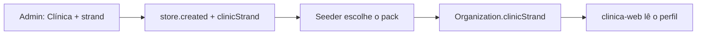

# Playbook — Vertentes da Clínica (`clinicStrand`)

> Guia operacional para criar **a próxima vertente** (nutrição, estética, medicina, …) sem redescobrir o que a implementação de Fisioterapia ensinou.
>
> Fonte de arquitetura original: plano `parecer_vertentes_clínica` (Cursor plans).  
> Este arquivo **não** lista o catálogo comercial de fisio — traz o **norte das superfícies** que mudam por vertente (§2), o pipeline, e as armadilhas reais da branch `feat/clinic/implementation-of-physiotherapy`.

**Última atualização:** 2026-08-18

---

## 1. Modelo (vale para qualquer vertente)

- A vertical de plataforma continua **`Clínica`**. A vertente é um escalar **`clinicStrand`** dentro da clínica (`odontologia` | `fisioterapia` | `nutricao` | futuras).
- **Invariante:** uma loja = exatamente uma vertente. Sem array, sem mix, sem “habilitar a outra depois”.
- **Imutável** depois do create da loja.
- Cada vertente tem um **pack de seed** irmão (`packs/<strand>/`), não um `if` gigante no template legado.
- A UI lê **`{ strand, features, copy }`** (profile / `members/me`) — nunca `if (nomeDaEspecialidade === '…')` nem hardcode de mapa por nome.
- Cargos clínicos: keys CASL estáveis **`dentista` / `dentista_admin`**. Só o **label** muda por pack (`clinicRoleLabel(role, strand)`). Toda vertente nova declara o par profissional + administrador.
- Conselho profissional: o pack declara `councilTypes`. Persistência em `Member.councilType` / `councilNumber` / `councilUf` (reuso; CREFITO usa regional `01`–`20` em `councilUf`).
- Billing / Keycloak: **sem** `Plan.clinicStrand` e **sem** role Keycloak por vertente. Continua `Clínica` / `vertical.clinic.view`.



### Flags de feature (catálogo em código)

Declaradas em `@citybox/messaging` / profile — a UI só consulta helpers (`storeShowsToothMap`, `storeShowsBodyMap`, `storeShowsImc`, `storeCouncilTypes`, …). **Nunca** `if (specialtyName === '…')`.

| Flag / capacidade | Efeito típico | Onde plugar |
| --- | --- | --- |
| `locationMaps: ['tooth']` | Odontograma + faces FDI | Orçamento, aba Prontuário, card mapa |
| `locationMaps: ['face']` / HOF | Harmonização / face | Mesmo fluxo; abre por `locationUiType: face_region` |
| `locationMaps: ['body']` | Mapa anatômico; **esconde dentes** | Idem; até o mapa visual existir, select de texto com ids estáveis |
| `showImc` | Aba **Cálculo de IMC** (+ card na Sobre) | `PATIENT_DETAIL_TABS` + `patient-detail-nav` |
| `showNutritionInitializeFlow` | Botão **Inicializar** (em vez de Finalizar) + sheet 3 abas → card evolução `nutrition_init` | Aba **Prontuário**; pack nutrição |
| `councilTypes` | Tipos no dialog / validação / PDF | Pack + `ResolveProfessionalCouncilService` + dialog |
| `copy.roleLabels` | Dentista / Fisioterapeuta / Nutricionista / … | `clinicRoleLabel`, OWNER seed, `GET /v1/members/roles` |
| Copy genérico (WhatsApp, placeholders) | Ex.: “sorrisos” no aniversário | Templates do pack / copy do profile |

---

## 2. Norte — o que alterar por vertente

Este é o inventário funcional do plano original (generalizado). Ao criar nutrição, estética, medicina etc., percorra **cada linha**: ou reusa o padrão da odonto, ou declara no pack / features, ou desliga com flag.

### 2.1 Plataforma e admin (obrigatório em toda vertente nova)

| Superfície | O que muda | Notas |
| --- | --- | --- |
| Catálogo `CLINIC_STRANDS` | Novo id + label + `features` + `copy` | `@citybox/messaging` (fonte única) |
| `Organization.clinicStrand` + evento | Aceitar o novo valor | Ausente → `odontologia`; inválido → 422 |
| Admin create | Select obrigatório **só depois** do pack existir | Detalhe da loja: vertente **read-only** / imutável |
| Billing / Keycloak | **Não muda** | Continua `Clínica` / `vertical.clinic.view` |
| Profile / `members/me` | Devolve `clinicStrand` + `features` + `copy` | UI só lê daí |

### 2.2 Pack de seed (`packs/<strand>/`) — conteúdo first-contact

| Superfície | O que muda | Notas |
| --- | --- | --- |
| **Plano Particular** | Especialidades + tratamentos + `locationUiType` (+ `acceptsFaces` se fizer sentido) | Sem tabela de equivalência com odonto. Preços: decisão de produto (fisio usou `0`/`0` no seed) |
| **Plano vazio no web** | Catálogo de nomes de especialidade por strand | Não hardcodar só odonto (`DEFAULT_CLINIC_PLAN_SPECIALTY_NAMES`) |
| **Anamneses** | Extras `scope: clinic` no pack | Biblioteca global de 15 **não muda**; novas perguntas = pack |
| **Contrato HTML** | Texto do pack | Espelho estrutural dos **mesmos 12 tokens**; revisão jurídica fora da feature |
| **Financeiro** | Categorias despesa/receita (+ cores) | Ex.: materiais / sessões da vertente |
| **Agenda** | Categorias de agendamento | Demo first-contact usa categorias da vertente (não “Consulta odontológica”) |
| **Equipe / OWNER** | Só o responsável do cadastro (OWNER); **sem** seed de Secretário/Gerente/Dentista/Fisioterapeuta. Labels do cargo clínico admin/profissional seguem o pack | Keys CASL **`dentista` / `dentista_admin`** sempre; só o label muda |
| **Paciente + slot demo** | Categorias / textos coerentes | Wall-clock do seed existente |

### 2.3 Localização no orçamento / tratamentos

| Superfície | O que muda | Notas |
| --- | --- | --- |
| `locationUiType` por especialidade | `tooth` \| `face_region` \| `body_region` \| `session` \| `none` | Override opcional no tratamento. Mata hardcode por nome (ex. HOF) |
| Feature `locationMaps` | Quais mapas a loja mostra | `body` → esconde dentes; até Parte 4, select de texto com ids |
| Persistência do local | Prefixo estável (`body:<id>`, FDI, face, …) | Display vem do catálogo, não do texto livre |
| Labels de coluna UI | “Dente” / “Região” / … e “Dentista” / profissional | Tabela do orçamento, ficha, PDF, placeholders |
| Mapa visual (se novo) | Assets + geometria + sexo/vista | Ver §5 (lições). Orçamento **e** aba tratamentos |

Enums de localização que a UI deve **gravar de fato** quando o pack usar: `session` (aula/sessão sem mapa) e `none` (avaliação/prevenção sem local).

### 2.4 Extras opcionais (só se a vertente precisar)

| Superfície | Flag / gatilho | O que mudar |
| --- | --- | --- |
| **IMC / antropometria** | `showImc` | Model de métricas (ou reuso `PatientBodyMetric`), aba na ficha, card Sobre, silhueta por **tipo** não por 0,1 |
| **Sessões no orçamento** | `budgetTreatmentSessions` | Campo **Sessões** abaixo de Plano no sheet Novo/Editar orçamento; ao Adicionar, expandir N `BudgetItem`s (valor unitário × N). Label `i/N` **só se N≥2** (sem `1/1`). Persistência: `sessionIndex`/`sessionTotal` nullable em `BudgetItem` e `PatientTreatment`. Helper FE: `storeShowsBudgetTreatmentSessions` — **não** `if (clinicStrand === 'fisioterapia')` solto |
| **Inicializar (nutrição)** | `showNutritionInitializeFlow` | Na aba **Prontuário**: botão **Inicializar** (não Finalizar). Sheet 3 abas (Anamnese \| Corporal \| Plano de procedimento) → `POST …/nutrition-init` cria evolução `source=nutrition_init` + JSON em `patient_nutrition_initiations`; tratamento **continua active** (toggle Mostrar finalizados usa `concludedTreatmentIds`). Reabrir pelo card (`GET …/nutrition-inits/:evolutionId`). Corporal: adipometria Petróski (≥2 medidas/dobra, calc no FE, gráficos **Distribuição de gordura**). Helper: `storeShowsNutritionInitializeFlow` |
| **Conselho profissional** | `councilTypes` no pack | Plugar no fluxo da main (1ª emissão). Novo tipo → enum + validação discriminada + dialog + label PDF. Preferir reusar campos (`councilUf` Char(2) já carrega regional CREFITO; CRN usa UF como CRM/CRO) |
| **Copy WhatsApp / marketing** | Pack / copy | Ajustar textos odontológicos (“sorrisos”, etc.) se a vertente pedir — não bloqueante |

### 2.5 Varredura de copy odonto-específica (sempre)

Antes de fechar a vertente, buscar e ramificar por strand / copy do pack:

- **Dente**, **Dentista**, **CRO**, **odontograma**, “Selecionar Dente”
- Hardcodes de especialidade por **nome**
- PDF de orçamento / receituário / atestado (label de conselho e profissional)
- Placeholders e headers de tabela na ficha e no sheet de orçamento

### 2.6 Decisões de produto recorrentes (acordar antes de codar)

- Uma loja = uma vertente (sem mix).
- Tratamentos do seed: com preço ou `0` (profissional cadastra depois)?
- Especialidades “casca” sem tratamentos no seed (como Estética / Pediátrica / Trabalho na fisio)?
- Precisa de mapa novo, reusa `body`/`tooth`/`face`, ou só `session`/`none`?
- Precisa de aba extra (`showImc` ou futura flag) e **em qual posição** na ficha?
- Conselho: quais tipos; regional vs UF; dialog fixo vs select?

---

## 3. Pipeline de partes (genérico)

Executar **uma parte por vez**. Gate: `lint` / `typecheck` / `test` nos pacotes tocados + `AGENTS.md`. Não abrir o select da nova vertente no admin antes do pack existir.

| Parte | Objetivo | Entregáveis típicos | Gate |
| --- | --- | --- | --- |
| **1 — Plumbing** | Campo atravessa a plataforma | Catálogo strand; coluna/evento; Organization; profile; admin **ainda sem** a nova opção (só default clássico) | Persistência + hidratação + 422 |
| **2 — Pack seed** | Loja nova nasce certa | `packs/<strand>/` (plano, anamneses, contrato, financeiro, agenda, labels); seeder; **repair** de plano; **aqui** o admin oferece a vertente; `locationMaps` já esconde mapas errados (select texto se mapa visual ainda não existe) | Create + retry store-setup coerentes |
| **3 — `locationUiType`** | Config dirige UI de local | Campo na especialidade (+ override); seed preenche; web defaults por strand; remove hardcode por nome | Orçamento abre o seletor certo |
| **4 — Mapa de localização** | Mapa usável (se a vertente tiver) | Assets alinhados, geometria, draft de ids, card ficha + orçamento | Persistência `prefix:<id>` estável |
| **5 — Extras do pack** | Features opcionais | Ex.: IMC (`showImc`), Inicializar nutrição (`showNutritionInitializeFlow`), outras abas/métricas | Flag no profile; UI só se flag |
| **6 — Conselho / copy** | Plugar tipos do pack | Enum/validação/dialog/PDF; copy residual | 1ª emissão + PDF corretos |

### O que **não** fazer em nenhuma parte

- App Nest/Next por vertente
- Tabela de equivalência 1:1 com odontologia
- Role Keycloak ou billing por strand
- Key de cargo nova por profissão (`fisioterapeuta`, `nutricionista`, …)
- Duas vertentes na mesma loja
- Oferecer a vertente no admin antes do pack (Parte 2)
- Tratar o catálogo seed como tabela oficial de conselho/TUSS — é catálogo **comercial**
- Re-seedar lojas da vertente antiga “porque sim”
- Reimplementar conselho do zero (já existe na main — só plugar tipos)
- Mutar o toggle de sexo do HOF para significar outra dimensão (ex.: frente/costas) — eixos separados

---

## 4. Onde vive o quê (mapa rápido)

| Camada | O quê |
| --- | --- |
| `packages/messaging` | `clinicStrand` no contrato de evento; catálogos compartilhados (conselho, …) |
| `admin-api` / `admin-web` | Create store + select de vertente; coluna / campo imutável no detalhe |
| `clinica-api` `Organization.clinicStrand` | Fonte canônica na vertical |
| `clinica-api` `packs/<strand>/` | Plano Particular, anamneses, contrato, agenda, labels |
| `ClinicStoreSeeder` | Resolve pack por strand; repair de plano se especialidades não batem |
| `clinica-web` `clinic-strand.ts` + profile | Features/helpers |
| `specialty-location-ui-type.ts` | Defaults / coerção de `locationUiType` por strand |
| Ficha paciente | Abas condicionais (`showImc`); cards de mapa por `locationMaps` |

Script útil (lojas já provisionadas com seed errado):

```bash
pnpm --filter @citybox/clinica-api exec tsx scripts/repair-plan-strand.ts <storeId>
```

---

## 5. Lições da branch de Fisioterapia (checklist para a próxima)

Estas falhas **não estavam explícitas** (ou estavam incompletas) no plano inicial e apareceram na implementação / calibração. Tratar como checklist obrigatório.

### 4.1 Seed / plano Particular

- **Problema:** loja criada como nova vertente podia ficar com especialidades/tratamentos do pack **odontologia** (race: select no admin antes do pack; ou retry idempotente que não re-seeda).
- **Correção:** `ensurePlanMatchesPack` / `plan-strand-repair` — se as especialidades do Particular não batem com o pack do `clinicStrand`, reseed idempotente do plano.
- **Para a próxima vertente:** nunca abrir o select no admin antes da Parte 2; sempre ter repair + script manual; testar create + retry do store-setup.

### 4.2 `locationUiType` e mapa que some

- **Problema:** no novo orçamento o mapa anatômico aparecia e **sumia ao escolher o tratamento**, porque opções do plano vinham com `tooth` (legado / strand ausente no map) e a UI só mostrava corpo quando `=== 'body_region'`.
- **Correção:**
  - Passar `clinicStrand` de `useStore()` ao mapear tratamentos do plano (`use-patient-plan-treatments` / `resolveEffectiveLocationUiType`).
  - Coerção defensiva: em strand sem mapa dentário, `tooth` → tipo de localização do pack (ex.: `body_region`).
  - Fallback de UI: se a clínica não mostra dentes e a localização exige seleção, manter o mapa corporal.
- **Para a próxima vertente:** defaults por strand **antes** de escolher item; coerção se o plano legado vier com enum errado; nunca depender só do valor gravado no item.

### 4.3 Labels “Dente” / “Dentista” na lista de tratamentos

- **Problema:** tabela do novo orçamento (e lista embutida) hardcodava **Dente** e **Dentista** mesmo em fisio.
- **Correção:** labels por strand em `patient-budget-treatments-table` (ex.: **Região** / **Fisioterapeuta** quando `body` e não `tooth`).
- **Para a próxima vertente:** qualquer string odontológica na ficha/orçamento/PDF/export precisa de ramo por strand ou copy do pack (`Dentista` → label do profissional; `Dente` → local do pack). Revisar também PDF (`build-patient-budget-pdf`) e placeholders “Selecionar Dente/Região”.

### 4.4 Mapa anatômico — geometria e assets

- **Problema:** marcações retangulares; desalinhadas do SVG; silhueta feminina mais estreita que a masculina; accordion duplicado em “Adicionar tratamento”.
- **Correções aplicadas:**
  - Paths/elipses orgânicos (padrão HOF), não retângulos.
  - Calibração iterativa (ombro, cotovelo, mão, tórax, abdômen, quadril, coxa, joelho, pé).
  - Escala horizontal das regiões no sexo feminino (`CORPogram_WOMAN_HORIZONTAL_SCALE`) + offset de coxa.
  - Estado default: contorno **pontilhado** quase invisível; ao marcar, fill com `--primary`.
  - Remover outline/retângulo de foco do browser nas regiões.
  - Silhueta via assets IMC (`public/clinic/imc/{male,female}_*.svg`) — viewBoxes **diferentes** entre sexos; não assumir um viewBox único sem transform.
  - Accordion/mapa **só** no card “Mapa anatômico”; no form “Adicionar tratamento” usar select de região.
- **Para a próxima vertente com mapa próprio:** alinhar assets **ou** documentar escala por sexo; não reutilizar coordenadas de outro sexo sem ajuste; legenda Aberto/Finalizado com bolinhas legíveis.

### 4.5 Controles de UI (sexo / expandir)

- Botão de sexo ao lado do expandir; símbolos grandes o bastante (Unicode ♀/♂ se o Lucide da versão do monorepo não tiver `Mars`/`Venus`).
- **Para a próxima:** checar exports do `lucide-react` pinado antes de importar ícones “novos”.

### 4.6 IMC / medições

- Medições **imutáveis** após create (sem editar/excluir na UI e sem PUT/DELETE na API).
- Silhueta por **faixa/tipo**, não por 0,1 de IMC.
- Aba **Cálculo de IMC** na ficha: ordem de navegação = **depois de Sobre** (não depois de Orçamentos).
- **Para a próxima:** abas condicionais entram em `PATIENT_DETAIL_TABS` na posição de produto desejada; `patient-detail-nav` filtra por flag.

### 4.7 Documentos — grade de cards

- Quatro cards em `2xl:grid-cols-4` quebravam o padrão 2×2.
- Manter `sm:grid-cols-2` como máximo salvo decisão explícita de layout.

### 4.8 Copy / formulários

- Preferir **Profissional** no label do campo quando o cargo muda por strand; “Dentista” só onde for copy de odonto.
- Não embutir mapa clicável em todo formulário que só precisa de um select de região.

---

## 6. Checklist ao criar a próxima vertente

Use junto com o inventário da **§2**.

1. [ ] Declara strand no catálogo (`messaging` + features/copy) — §2.1
2. [ ] Parte 1 sem oferecer a vertente no admin
3. [ ] Pack seed completo (plano, anamneses, contrato, financeiro, agenda, labels) + seeder + **repair** — §2.2
4. [ ] `locationUiType` em toda especialidade do seed; defaults no web por strand — §2.3
5. [ ] Coerção se item legado vier com tipo de mapa da vertente errada
6. [ ] Varredura de copy odonto (§2.5) + labels de tabela/PDF
7. [ ] Mapa (se houver): assets, geometria, sexo/vista; até lá, select de texto + `locationMaps` escondendo dentes
8. [ ] Flags de aba/card (`showImc`, `showNutritionInitializeFlow`, `locationMaps`, …) + ordem das abas — §2.4
9. [ ] Conselho: só tipos do pack; validação discriminada; PDF
10. [ ] Decisões de produto (§2.6) documentadas no PR / AGENTS
11. [ ] Atualizar `AGENTS.md` dos módulos tocados na mesma PR
12. [ ] Testar: create loja nova, retry store-setup, orçamento (mapa não some ao escolher tratamento), ficha tratamentos (Finalizar **ou** Inicializar conforme flag), documentos, conselho na 1ª emissão

---

## 7. Referências no monorepo

| Artefato | Caminho |
| --- | --- |
| Contrato strand / evento | `packages/messaging/src/contracts/clinic-strand.ts`, `store-events.ts` |
| Conselho (CRM/CRO/CREFITO/CRN) | `packages/messaging/src/contracts/professional-council.ts` |
| Packs seed | `apps/verticals/clinica/api/src/modules/store-setup/application/seed-data/packs/` |
| Repair de plano | `…/plan-strand-repair.ts`, `scripts/repair-plan-strand.ts` |
| Helpers web | `apps/verticals/clinica/web/src/lib/clinic-strand.ts` |
| Location UI | `…/settings/plans/data/specialty-location-ui-type.ts` |
| Mapa anatômico | `…/budgets/corpogram/` |
| Abas da ficha | `…/lib/patient-detail-tabs.ts` |
| Nutrição Inicializar | `…/patient-treatments/…/initialize-nutrition/`, `patient-nutrition-init-sheet.tsx` |
| Plano Cursor (histórico) | `~/.cursor/plans/parecer_vertentes_clínica_e925f3d0.plan.md` |

---

## 8. Histórico deste playbook

| Data | Nota |
| --- | --- |
| 2026-08-18 | Nutrição: Petróski (≥2 medidas, gráficos Distribuição de gordura); Inicializar mantém `active`; copy aba **Prontuário** / **Procedimento**; fisio sem aviso `none` no Adicionar |
| 2026-08-14 | Nutrição: `showNutritionInitializeFlow` + CRN; pack `nutricao`; `locationUiType=none`; Parte 4 mapa N/A |
| 2026-08-13 | Feature opcional `budgetTreatmentSessions` (§2.4) — sessões no sheet de orçamento (só fisio) |
| 2026-08-12 | Inventário §2 (superfícies do plano) + pipeline com entregáveis; catálogo comercial de fisio continua fora |
| 2026-08-12 | Extraído do plano de vertentes + correções da branch de Fisioterapia (seed/repair, mapa, labels Dente/Dentista, IMC, UI, assets femininos). |
