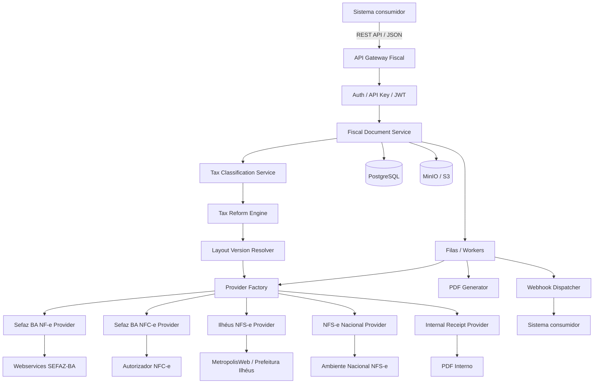
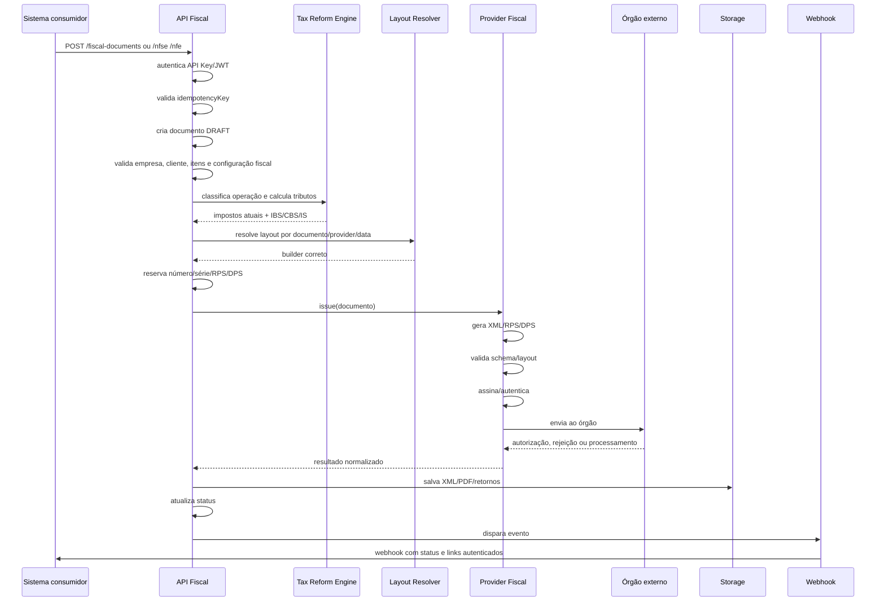
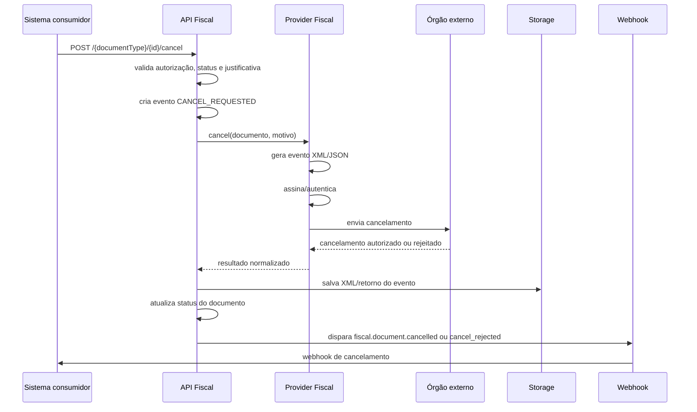
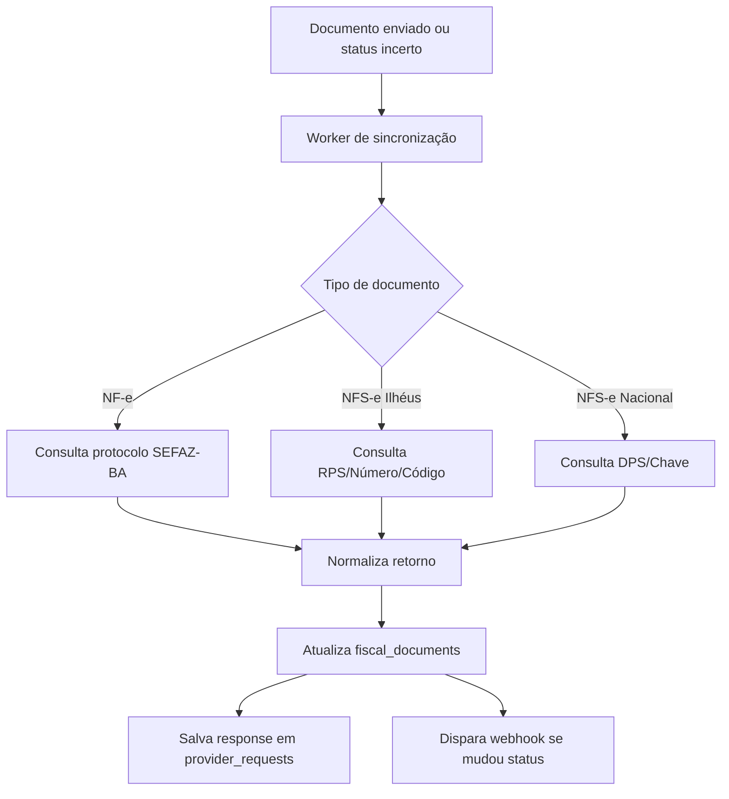
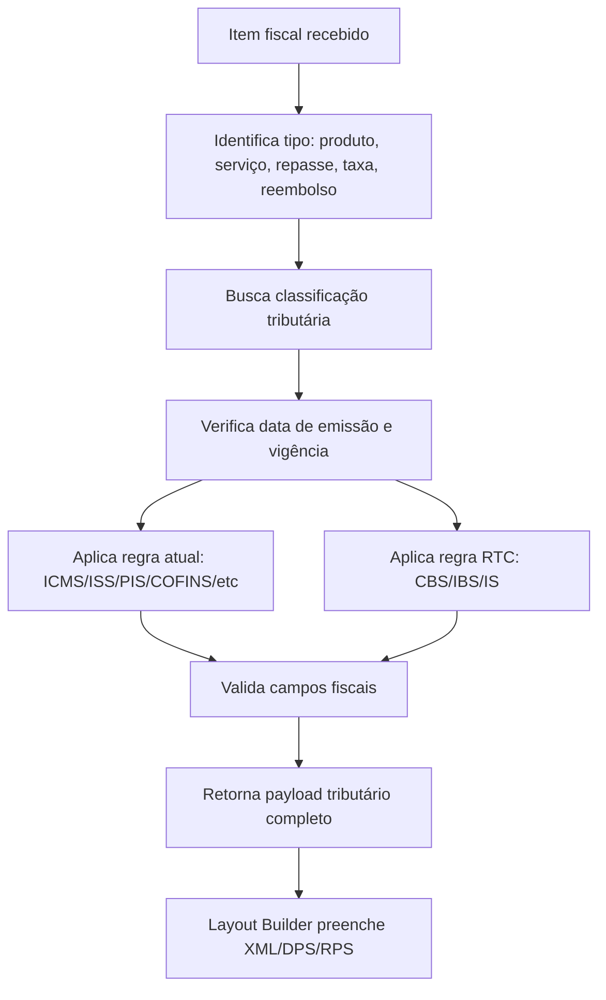
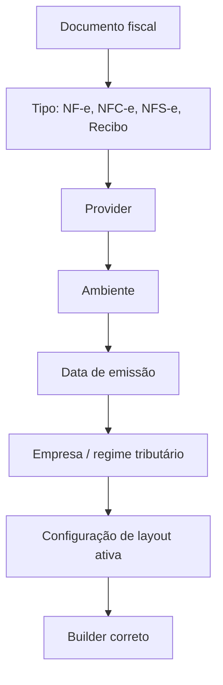

# API Fiscal Centralizada — Documentação Técnica e Funcional

**Versão:** 1.0  
**Objetivo:** orientar o início do desenvolvimento de uma API fiscal própria, reutilizável por qualquer sistema consumidor, com suporte a NF-e, NFC-e, NFS-e Municipal, NFS-e Nacional, recibos internos, eventos fiscais, XML, PDF, certificados digitais, webhooks, Reforma Tributária do Consumo e evolução contínua de layouts.

> Esta documentação descreve arquitetura, módulos, fluxos, dados de entrada, dados de saída, integrações oficiais, segurança, versionamento e estratégia de evolução. A implementação técnica deve ser validada continuamente com contador, legislação vigente, manuais oficiais, notas técnicas e ambientes de homologação/produção dos órgãos responsáveis.

---

## 1. Objetivo da API

A API Fiscal será um serviço independente, centralizado e reutilizável, responsável por todo o ciclo de vida dos documentos fiscais eletrônicos.

Ela deve permitir que qualquer sistema consumidor solicite emissão, cancelamento, consulta, geração de PDF, recuperação de XML e acompanhamento de status sem precisar conhecer os detalhes técnicos de cada órgão fiscal.

O sistema consumidor informa os dados necessários da operação. A API Fiscal decide:

- qual tipo de documento emitir;
- qual provider utilizar;
- qual layout aplicar;
- qual certificado digital usar;
- qual numeração/série reservar;
- quais regras tributárias validar;
- quais campos da Reforma Tributária preencher;
- onde armazenar XML e PDF;
- como devolver o resultado;
- como notificar o sistema consumidor via webhook.

---

## 2. Escopo inicial

### 2.1 Documentos suportados

| Documento | Órgão / Ambiente | Finalidade |
|---|---|---|
| NF-e modelo 55 | SEFAZ-BA / Ambiente Nacional NF-e | Venda de mercadoria/produto, operações estaduais/nacionais |
| NFC-e modelo 65 | SEFAZ-BA ou autorizador definido | Venda ao consumidor final, quando necessário |
| NFS-e Municipal | Prefeitura de Ilhéus-BA / MetropolisWeb/POLIS | Prestação de serviços em Ilhéus-BA |
| NFS-e Nacional | Ambiente Nacional NFS-e | Padrão nacional de serviços, DPS, ADN, APIs oficiais |
| Recibo interno | API própria | Documento operacional/comercial, sem substituir obrigação fiscal quando houver exigência de nota |

### 2.2 Funções obrigatórias

- Cadastro de empresas emitentes.
- Cadastro e armazenamento seguro de certificados digitais A1.
- Cadastro de clientes/tomadores/destinatários.
- Cadastro de produtos e serviços fiscais.
- Cadastro de classificações tributárias.
- Emissão de NF-e.
- Cancelamento de NF-e.
- Consulta de NF-e.
- Inutilização de numeração de NF-e.
- Carta de Correção Eletrônica, quando aplicável.
- Geração de DANFE.
- Emissão de NFC-e, em fase posterior.
- Emissão de NFS-e Ilhéus.
- Cancelamento de NFS-e Ilhéus.
- Consulta de NFS-e Ilhéus por RPS, número ou código de verificação.
- Emissão de NFS-e Nacional por DPS.
- Cancelamento/substituição de NFS-e Nacional.
- Consulta de NFS-e Nacional por DPS, chave ou referência.
- Geração de recibo interno.
- Armazenamento de XML, PDF, eventos e retornos.
- Envio de webhooks para sistemas consumidores.
- Controle de idempotência para impedir notas duplicadas.
- Auditoria completa.
- Suporte à Reforma Tributária: CBS, IBS e Imposto Seletivo.
- Versionamento de layouts por tipo de documento, provider e data de vigência.

---

## 3. Fontes oficiais e links de referência

> Estes links devem ser mantidos no README do projeto e revisados periodicamente. As integrações fiscais mudam por notas técnicas, novas versões de schemas, atualizações de endpoints e alterações legais.

### 3.1 NF-e / NFC-e — SEFAZ-BA e Portal Nacional

- SEFAZ-BA — Nota Fiscal Eletrônica:  
  https://www.sefaz.ba.gov.br/inspetoria-eletronica/icms/documentos-fiscais/nota-fiscal-eletronica/

- Webservices NF-e Bahia — produção e homologação, listados na página da SEFAZ-BA:  
  https://www.sefaz.ba.gov.br/inspetoria-eletronica/icms/documentos-fiscais/nota-fiscal-eletronica/

- Portal Nacional da NF-e:  
  https://www.nfe.fazenda.gov.br/portal/

- Serviços Web da NF-e:  
  https://www.nfe.fazenda.gov.br/portal/webServices.aspx?tipoConteudo=OUC/YVNWZfo=

- Disponibilidade dos serviços NF-e:  
  https://www.nfe.fazenda.gov.br/portal/disponibilidade.aspx

- Manuais, schemas e notas técnicas da NF-e/SVRS:  
  https://dfe-portal.svrs.rs.gov.br/NFE/Documentos

### 3.2 Reforma Tributária do Consumo — IBS, CBS e IS

- Orientações da Receita Federal para 2026:  
  https://www.gov.br/receitafederal/pt-br/acesso-a-informacao/acoes-e-programas/programas-e-atividades/reforma-tributaria-do-consumo/orientacoes-2026

- Comunicado conjunto Receita Federal e Comitê Gestor do IBS:  
  https://www.gov.br/receitafederal/pt-br/assuntos/noticias/2025/dezembro/comunicado-conjunto

- NT 2025.002 — Reforma Tributária NF-e/NFC-e:  
  https://www.nfe.fazenda.gov.br/portal/listaConteudo.aspx?tipoConteudo=04BIflQt1aY=

- Informes Técnicos e tabelas de classificação tributária IBS/CBS:  
  https://www.nfe.fazenda.gov.br/portal/listaConteudo.aspx?tipoConteudo=hXzemuyNHW4=

- Tabela de Código de Classificação Tributária do IBS/CBS — cClassTrib:  
  https://www.nfe.fazenda.gov.br/portal/listaConteudo.aspx?tipoConteudo=/NJarYc9nus=

### 3.3 NFS-e Nacional

- Portal Nacional da NFS-e:  
  https://www.gov.br/nfse/

- Documentação técnica NFS-e Nacional:  
  https://www.gov.br/nfse/pt-br/biblioteca/documentacao-tecnica

- Documentação atual de produção:  
  https://www.gov.br/nfse/pt-br/biblioteca/documentacao-tecnica/documentacao-atual

- APIs de Produção Restrita e Produção:  
  https://www.gov.br/nfse/pt-br/biblioteca/documentacao-tecnica/apis-prod-restrita-e-producao

- Portal Contribuinte / Emissor Nacional:  
  https://www.nfse.gov.br/EmissorNacional

- APIs Produção Restrita — ADN / Contribuintes / DANFSE / SEFIN Nacional:  
  https://www.gov.br/nfse/pt-br/biblioteca/documentacao-tecnica/apis-prod-restrita-e-producao

### 3.4 NFS-e Ilhéus-BA

- Portal POLIS WEB / MetropolisWeb — Ilhéus:  
  https://ilheus.metropolisweb.com.br/metropolisWEB

- Prefeitura de Ilhéus:  
  https://www.ilheus.ba.gov.br/

- Página de serviços da prefeitura, onde devem ser localizados links de Nota Fiscal Eletrônica, Integração à NFS-e Nacional, NFS-e e solicitações relacionadas:  
  https://www.ilheus.ba.gov.br/

- E-mail operacional citado em materiais de mercado para solicitação/regularização de liberação de emissão via webservice em Ilhéus:  
  nfe@ilheus.ba.gov.br

> O provider Ilhéus deve ser implementado somente após obtenção ou confirmação formal do manual técnico, credenciais, endpoints, layout XML/RPS, regras de assinatura/autenticação e ambiente de teste/produção junto ao município ou sistema MetropolisWeb/POLIS.

---

## 4. Princípio arquitetural

A API Fiscal deve ser construída como uma **plataforma fiscal multi-provider**, e não como um módulo preso a um sistema específico.

### 4.1 Frase-guia

> Qualquer sistema consumidor envia uma solicitação fiscal simples. A API Fiscal resolve a complexidade de SEFAZ, Prefeitura, NFS-e Nacional, XML, certificado, eventos, PDF, cancelamento, consulta, regras tributárias e layouts.

### 4.2 Sistemas consumidores

O nome ou domínio dos sistemas consumidores não deve ser codificado na API. A API deve receber:

- `sourceSystem`: identificador lógico do sistema consumidor;
- `externalReference`: referência externa do documento no sistema consumidor;
- `tenantId`: organização/ambiente proprietário dos dados;
- `companyId`: empresa emitente;
- `documentType`: tipo fiscal solicitado;
- `idempotencyKey`: chave para evitar duplicidade.

---

## 5. Desenho geral de integração



---

## 6. Arquitetura de serviços

### 6.1 Componentes principais

```text
API Fiscal
│
├── API Gateway / Auth
├── Fiscal Core
├── Certificate Vault
├── Tax Classification Service
├── Tax Reform Engine
├── Layout Version Resolver
├── Provider Factory
├── XML Builder
├── Signature Service
├── SOAP / HTTP Clients
├── PDF Generator
├── Storage Service
├── Queue / Worker Service
├── Webhook Dispatcher
├── Audit Log Service
└── Observability
```

### 6.2 Deploy inicial

```text
api-fiscal
├── fiscal-api        # NestJS REST API
├── fiscal-worker     # workers de emissão, consulta, cancelamento, PDF, webhooks
├── postgres          # banco relacional
├── redis ou rabbitmq # filas
├── minio             # XML, PDF, certificados criptografados
└── nginx             # reverse proxy + HTTPS
```

### 6.3 Evolução futura

```text
Produção madura
├── API escalável horizontalmente
├── workers por fila e tipo fiscal
├── storage S3 compatível
├── banco com backup e replicação
├── observabilidade com métricas e tracing
├── rotação de chaves
├── secrets manager
└── filas dedicadas para operações críticas
```

---

## 7. Estrutura de módulos NestJS

```text
src/
├── main.ts
├── app.module.ts
│
├── common/
│   ├── guards/
│   ├── decorators/
│   ├── interceptors/
│   ├── filters/
│   └── utils/
│
├── modules/
│   ├── auth/
│   ├── tenants/
│   ├── api-clients/
│   ├── companies/
│   ├── certificates/
│   ├── customers/
│   ├── products-services/
│   ├── tax-classifications/
│   ├── tax-reform/
│   ├── fiscal-documents/
│   ├── fiscal-events/
│   ├── sequences/
│   ├── receipts/
│   ├── nfe/
│   ├── nfce/
│   ├── nfse/
│   ├── providers/
│   │   ├── sefaz-ba/
│   │   ├── ilheus-metropolis/
│   │   └── nfse-nacional/
│   ├── layouts/
│   ├── xml/
│   ├── signatures/
│   ├── pdf/
│   ├── storage/
│   ├── webhooks/
│   ├── jobs/
│   ├── audit-logs/
│   └── health/
│
└── prisma/
```

---

## 8. Padrão Provider

A API deve isolar cada integração oficial em providers.

### 8.1 Interface genérica

```ts
export interface FiscalProvider {
  issue(input: IssueDocumentInput): Promise<IssueDocumentResult>;
  cancel(input: CancelDocumentInput): Promise<CancelDocumentResult>;
  consult(input: ConsultDocumentInput): Promise<ConsultDocumentResult>;
  getStatus?(input: ProviderStatusInput): Promise<ProviderStatusResult>;
}
```

### 8.2 Providers iniciais

```text
SefazBaNfeProvider
SefazBaNfceProvider
IlheusMetropolisNfseProvider
NfseNacionalProvider
InternalReceiptProvider
```

### 8.3 Provider Factory

```ts
type ProviderType =
  | 'SEFAZ_BA_NFE'
  | 'SEFAZ_BA_NFCE'
  | 'ILHEUS_METROPOLIS_NFSE'
  | 'NFSE_NACIONAL'
  | 'INTERNAL_RECEIPT';

@Injectable()
export class FiscalProviderFactory {
  getProvider(document: FiscalDocument, config: ProviderConfig): FiscalProvider {
    switch (config.provider) {
      case 'SEFAZ_BA_NFE':
        return this.sefazBaNfeProvider;
      case 'SEFAZ_BA_NFCE':
        return this.sefazBaNfceProvider;
      case 'ILHEUS_METROPOLIS_NFSE':
        return this.ilheusMetropolisProvider;
      case 'NFSE_NACIONAL':
        return this.nfseNacionalProvider;
      case 'INTERNAL_RECEIPT':
        return this.internalReceiptProvider;
      default:
        throw new Error('Provider fiscal não configurado');
    }
  }
}
```

---

## 9. Fluxo completo de emissão



---

## 10. Fluxo completo de cancelamento



---

## 11. Fluxo completo de consulta/sincronização



---

## 12. NF-e SEFAZ-BA

### 12.1 Serviços esperados

Conforme página da SEFAZ-BA, os webservices de NF-e 4.0 em produção incluem:

```text
NFeAutorizacao4
NFeRetAutorizacao4
NFeInutilizacao4
NFeStatusServico4
NFeRecepcaoEvento4
NFeConsultaProtocolo4
CadConsultaCadastro4
```

Homologação usa endpoints equivalentes em `hnfe.sefaz.ba.gov.br`.

### 12.2 Fluxo de emissão NF-e

```text
1. Sistema consumidor envia solicitação NF-e.
2. API valida empresa emitente.
3. API valida certificado A1.
4. API valida destinatário.
5. API valida produtos, NCM, CFOP, CST/CSOSN, cClassTrib e regras fiscais.
6. API calcula impostos atuais e campos IBS/CBS/IS.
7. API reserva número e série.
8. API monta XML NF-e 4.00 ou layout vigente.
9. API valida XML contra schema XSD.
10. API assina XML.
11. API envia para NFeAutorizacao4.
12. API consulta retorno em NFeRetAutorizacao4, quando necessário.
13. API salva XML autorizado e protocolo.
14. API gera DANFE.
15. API dispara webhook ao sistema consumidor.
```

### 12.3 Fluxos NF-e obrigatórios

- Status do serviço.
- Autorização.
- Retorno de autorização.
- Consulta de protocolo.
- Cancelamento por evento.
- Carta de Correção por evento.
- Inutilização de numeração.
- Armazenamento de XML autorizado.
- Geração de DANFE.
- Consulta cadastro, quando aplicável.
- Tratamento de rejeições.
- Contingência/EPEC, em fase futura.

### 12.4 Status NF-e internos

```text
DRAFT
VALIDATING
NUMBER_RESERVED
XML_GENERATED
SIGNED
SENT
PROCESSING
AUTHORIZED
REJECTED
DENIED
CANCEL_REQUESTED
CANCEL_AUTHORIZED
CANCEL_REJECTED
CORRECTION_LETTER_AUTHORIZED
INUTILIZED
ERROR
SYNC_REQUIRED
```

---

## 13. NFC-e SEFAZ-BA

A NFC-e deve ser preparada como fase posterior, mas a arquitetura deve nascer pronta.

### 13.1 Funções NFC-e

- Cadastro de CSC/token, quando aplicável.
- Emissão NFC-e modelo 65.
- Cancelamento.
- Consulta.
- Inutilização.
- QR Code.
- DANFE NFC-e.
- Contingência.

### 13.2 Campos adicionais

```text
consumer_document
presence_indicator
payment_methods
change_amount
csc_id
csc_token_encrypted
qr_code_url
```

---

## 14. NFS-e Ilhéus-BA

### 14.1 Estratégia

Ilhéus-BA utiliza o portal MetropolisWeb/POLIS. A API deve ter um provider específico:

```text
IlheusMetropolisNfseProvider
```

O provider só deve entrar em produção após confirmação formal de:

- endpoint de homologação;
- endpoint de produção;
- layout XML/RPS;
- autenticação;
- uso ou não de certificado;
- regra de assinatura;
- método de envio;
- método de consulta;
- método de cancelamento;
- códigos de serviço;
- regras de ISS;
- processo de habilitação para emissão por integração.

### 14.2 Fluxo Ilhéus

```text
1. Sistema consumidor solicita NFS-e.
2. API identifica empresa emitente com município Ilhéus-BA.
3. API identifica provider ILHEUS_METROPOLIS_NFSE.
4. API valida inscrição municipal, serviço, tomador e valores.
5. API gera RPS.
6. API monta XML conforme layout municipal.
7. API assina/autentica se exigido.
8. API envia lote/RPS.
9. API consulta retorno por RPS/lote.
10. API salva número da NFS-e, código de verificação, XML e PDF.
11. API dispara webhook.
```

### 14.3 Status NFS-e Ilhéus

```text
DRAFT
RPS_CREATED
RPS_SENT
PROCESSING
AUTHORIZED
REJECTED
CANCEL_REQUESTED
CANCELLED
CANCEL_REJECTED
ERROR
SYNC_REQUIRED
```

### 14.4 Campos de configuração Ilhéus

```text
municipality_code_ibge
municipal_registration
provider_username
provider_password_or_token
certificate_id
rps_series
current_rps_number
service_tax_regime
iss_rate_default
municipal_service_code_default
environment
active
```

---

## 15. NFS-e Nacional

### 15.1 Estratégia

A API deve nascer preparada para NFS-e Nacional, mesmo que a primeira operação seja com provider municipal.

O sistema deve suportar:

- DPS — Declaração de Prestação de Serviço;
- emissão via APIs nacionais;
- produção restrita;
- produção;
- consulta por DPS;
- consulta por chave;
- cancelamento;
- substituição;
- DANFSE;
- ADN;
- parametrização municipal;
- integração futura com regras da Reforma Tributária.

### 15.2 Fluxo de emissão NFS-e Nacional

```text
1. Sistema consumidor solicita NFS-e.
2. API identifica provider NFSE_NACIONAL.
3. API valida prestador, tomador, serviço, município e parametrização.
4. API gera DPS.
5. API calcula ISS, CBS, IBS e demais campos aplicáveis.
6. API monta payload/XML conforme documentação vigente.
7. API assina/autentica conforme padrão nacional.
8. API envia ao Ambiente Nacional.
9. API recebe NFS-e autorizada, rejeição ou processamento pendente.
10. Worker consulta por DPS, se necessário.
11. API salva XML/retorno/PDF.
12. API dispara webhook.
```

### 15.3 Status NFS-e Nacional

```text
DRAFT
DPS_CREATED
DPS_SENT
PROCESSING
AUTHORIZED
REJECTED
CANCEL_REQUESTED
CANCELLED
CANCEL_REJECTED
REPLACE_REQUESTED
REPLACED
ERROR
SYNC_REQUIRED
```

### 15.4 Migração Ilhéus → NFS-e Nacional

A API deve permitir trocar o provider por configuração, sem alterar os sistemas consumidores.

```text
Antes:
provider = ILHEUS_METROPOLIS_NFSE

Depois:
provider = NFSE_NACIONAL
```

O endpoint consumidor continua o mesmo:

```http
POST /nfse
```

---

## 16. Reforma Tributária do Consumo

### 16.1 Objetivo do Tax Reform Engine

O **Tax Reform Engine** será responsável por classificar itens, aplicar regras tributárias vigentes e preencher os campos de CBS, IBS e Imposto Seletivo, conforme o documento fiscal, data de emissão, provider e layout.

### 16.2 Tributos contemplados

- CBS — Contribuição sobre Bens e Serviços.
- IBS Estadual.
- IBS Municipal.
- Imposto Seletivo — IS.
- ISS atual, quando NFS-e municipal.
- ICMS/IPI/PIS/COFINS atuais, quando aplicável à NF-e/NFC-e durante a transição.

### 16.3 Campos obrigatórios para classificação

```text
item_type
operation_type
ncm
cfop
service_code
national_service_code
municipality_code
cst_current
csosn_current
cst_ibs_cbs
c_class_trib
applies_cbs
applies_ibs
applies_is
cbs_rate
ibs_state_rate
ibs_city_rate
is_rate
reduction_cbs
reduction_ibs
credit_presumed_rate
valid_from
valid_until
```

### 16.4 Fluxo de cálculo tributário



### 16.5 Regras importantes

- O sistema deve suportar coexistência de tributos atuais e novos tributos durante o período de transição.
- A obrigatoriedade dos campos deve ser controlada por data, nota técnica, documento e ambiente.
- A API não deve hardcodar alíquotas de forma fixa; deve usar tabelas versionadas.
- `cClassTrib` e `CST IBS/CBS` devem ser tabelados e atualizáveis.
- A API deve permitir importar novas versões das tabelas oficiais.
- O cálculo tributário deve gerar memória de cálculo por item.
- O retorno da API deve indicar quais campos foram aplicados automaticamente e quais precisam de revisão contábil.

---

## 17. Versionamento de layout

### 17.1 Necessidade

A API Fiscal deve sobreviver às mudanças constantes de legislação, notas técnicas, schemas e layouts.

Não deve existir apenas um builder fixo por documento. Deve existir um motor de layout versionado.

### 17.2 Layouts iniciais

```text
NFE_4_00_CURRENT
NFE_4_00_RTC_NT_2025_002
NFCE_4_00_CURRENT
NFCE_4_00_RTC_NT_2025_002
NFSE_ILHEUS_METROPOLIS_CURRENT
NFSE_NACIONAL_DPS_CURRENT
NFSE_NACIONAL_DPS_RTC
INTERNAL_RECEIPT_V1
```

### 17.3 Resolução de layout



### 17.4 Tabela de versões

```sql
fiscal_layout_versions
- id
- document_type
- provider
- layout_key
- version
- valid_from
- valid_until
- is_default
- schema_path
- notes
- active
```

---

## 18. Informações que os sistemas consumidores precisam enviar

### 18.1 Campos comuns obrigatórios

```json
{
  "sourceSystem": "string",
  "externalReference": "string",
  "documentType": "NFE | NFCE | NFSE | RECEIPT",
  "companyId": "uuid",
  "environment": "HOMOLOGATION | PRODUCTION",
  "idempotencyKey": "string"
}
```

### 18.2 Empresa emitente

Normalmente o sistema consumidor envia apenas `companyId`. A API busca o cadastro completo.

A empresa precisa estar previamente cadastrada com:

```text
CNPJ
razão social
nome fantasia
inscrição estadual
inscrição municipal
regime tributário
CNAE
endereço completo
código IBGE do município
UF
certificado digital ativo
configuração NF-e/NFC-e/NFS-e
séries e numerações
provider fiscal
```

### 18.3 Cliente / destinatário / tomador

```json
{
  "customer": {
    "name": "Cliente Exemplo",
    "cpfCnpj": "00000000000",
    "type": "INDIVIDUAL | COMPANY",
    "email": "cliente@email.com",
    "phone": "string",
    "stateRegistration": "string",
    "municipalRegistration": "string",
    "address": {
      "street": "string",
      "number": "string",
      "complement": "string",
      "district": "string",
      "city": "string",
      "cityCodeIbge": "string",
      "uf": "BA",
      "zipCode": "string",
      "countryCode": "1058"
    }
  }
}
```

### 18.4 Itens fiscais

```json
{
  "items": [
    {
      "description": "Serviço ou produto",
      "quantity": 1,
      "unitValue": 850.00,
      "totalValue": 850.00,
      "itemType": "SERVICE | PRODUCT | FEE_REIMBURSEMENT | THIRD_PARTY_SERVICE | INTERNAL_RECEIPT_ITEM",
      "serviceCode": "17.02",
      "nationalServiceCode": "string",
      "ncm": "string",
      "cfop": "string",
      "cst": "string",
      "csosn": "string",
      "taxClassificationId": "uuid",
      "metadata": {
        "costCenter": "string",
        "plate": "string",
        "serviceOrderId": "string"
      }
    }
  ]
}
```

### 18.5 Dados específicos para NF-e

```json
{
  "nfe": {
    "operationNature": "Venda de mercadoria",
    "operationType": "OUTBOUND | INBOUND",
    "destinationIndicator": "INTERNAL | INTERSTATE | FOREIGN",
    "finalConsumer": true,
    "presenceIndicator": "PRESENTIAL | INTERNET | PHONE | OTHERS",
    "freightMode": "NO_FREIGHT | SENDER | RECEIVER",
    "payment": {
      "method": "CASH | PIX | CREDIT_CARD | BANK_TRANSFER | OTHERS",
      "amount": 850.00
    }
  }
}
```

### 18.6 Dados específicos para NFS-e

```json
{
  "nfse": {
    "serviceDescription": "Serviços prestados",
    "municipalServiceCode": "17.02",
    "nationalServiceCode": "string",
    "serviceCityCodeIbge": "2913606",
    "taxationCityCodeIbge": "2913606",
    "issWithheld": false,
    "issRate": 0.05,
    "deductions": 0,
    "unconditionedDiscount": 0,
    "conditionedDiscount": 0,
    "additionalInfo": "string"
  }
}
```

### 18.7 Metadados para integração

```json
{
  "metadata": {
    "originModule": "string",
    "originUserId": "string",
    "serviceOrderId": "string",
    "financialClosureId": "string",
    "customerPortalReference": "string",
    "tags": ["string"]
  }
}
```

---

## 19. Resposta padrão da API

### 19.1 Emissão aceita para processamento

```json
{
  "documentId": "uuid",
  "status": "PROCESSING",
  "documentType": "NFSE",
  "provider": "NFSE_NACIONAL",
  "sourceSystem": "string",
  "externalReference": "string",
  "message": "Documento fiscal recebido e enviado para processamento"
}
```

### 19.2 Documento autorizado

```json
{
  "documentId": "uuid",
  "status": "AUTHORIZED",
  "documentType": "NFSE",
  "provider": "NFSE_NACIONAL",
  "number": "12345",
  "series": "1",
  "accessKey": "string",
  "verificationCode": "string",
  "protocol": "string",
  "authorizedAt": "2026-01-10T10:00:00Z",
  "xmlUrl": "https://api-fiscal.example.com/fiscal-documents/uuid/xml",
  "pdfUrl": "https://api-fiscal.example.com/fiscal-documents/uuid/pdf"
}
```

### 19.3 Documento rejeitado

```json
{
  "documentId": "uuid",
  "status": "REJECTED",
  "errorCode": "E001",
  "errorMessage": "Motivo retornado pelo órgão autorizador",
  "providerPayload": {
    "rawCode": "string",
    "rawMessage": "string"
  }
}
```

---

## 20. Endpoints principais

### 20.1 Empresas

```http
POST   /companies
GET    /companies
GET    /companies/{id}
PATCH  /companies/{id}
```

### 20.2 Certificados

```http
POST   /companies/{companyId}/certificates
GET    /companies/{companyId}/certificates
PATCH  /certificates/{id}/activate
GET    /certificates/{id}/status
```

### 20.3 Documento fiscal genérico

```http
POST   /fiscal-documents
GET    /fiscal-documents/{id}
POST   /fiscal-documents/{id}/issue
POST   /fiscal-documents/{id}/cancel
POST   /fiscal-documents/{id}/sync-status
GET    /fiscal-documents/{id}/xml
GET    /fiscal-documents/{id}/pdf
GET    /fiscal-documents/{id}/events
```

### 20.4 NF-e

```http
POST   /nfe
POST   /nfe/{id}/issue
POST   /nfe/{id}/cancel
POST   /nfe/{id}/correction-letter
POST   /nfe/inutilize
POST   /nfe/{id}/sync-status
GET    /nfe/{id}
GET    /nfe/{id}/xml
GET    /nfe/{id}/danfe
GET    /nfe/status/sefaz-ba
```

### 20.5 NFC-e

```http
POST   /nfce
POST   /nfce/{id}/issue
POST   /nfce/{id}/cancel
POST   /nfce/inutilize
GET    /nfce/{id}/danfe
```

### 20.6 NFS-e

```http
POST   /nfse
POST   /nfse/{id}/issue
POST   /nfse/{id}/cancel
POST   /nfse/{id}/replace
POST   /nfse/{id}/sync-status
POST   /nfse/consult-by-rps
POST   /nfse/consult-by-dps
POST   /nfse/consult-by-number
POST   /nfse/consult-by-key
GET    /nfse/{id}
GET    /nfse/{id}/xml
GET    /nfse/{id}/pdf
GET    /nfse/{id}/events
```

### 20.7 Recibos

```http
POST   /receipts
GET    /receipts/{id}
GET    /receipts/{id}/pdf
```

### 20.8 Webhooks

```http
POST   /webhooks
GET    /webhooks
PATCH  /webhooks/{id}
POST   /webhooks/{id}/test
```

---

## 21. Webhooks

### 21.1 Eventos

```text
fiscal.nfe.authorized
fiscal.nfe.rejected
fiscal.nfe.denied
fiscal.nfe.cancelled
fiscal.nfe.cancel_rejected
fiscal.nfe.correction_letter_authorized
fiscal.nfe.inutilized

fiscal.nfce.authorized
fiscal.nfce.rejected
fiscal.nfce.cancelled

fiscal.nfse.authorized
fiscal.nfse.rejected
fiscal.nfse.cancelled
fiscal.nfse.cancel_rejected
fiscal.nfse.replaced

fiscal.receipt.generated
fiscal.document.pdf_generated
fiscal.document.error
fiscal.document.sync_required
```

### 21.2 Payload padrão

```json
{
  "event": "fiscal.nfse.authorized",
  "eventId": "uuid",
  "documentId": "uuid",
  "sourceSystem": "string",
  "externalReference": "string",
  "documentType": "NFSE",
  "provider": "NFSE_NACIONAL",
  "status": "AUTHORIZED",
  "number": "123",
  "series": "1",
  "accessKey": "string",
  "verificationCode": "ABC123",
  "xmlUrl": "https://api-fiscal.example.com/fiscal-documents/uuid/xml",
  "pdfUrl": "https://api-fiscal.example.com/fiscal-documents/uuid/pdf",
  "occurredAt": "2026-01-10T10:00:00Z"
}
```

### 21.3 Assinatura

```http
X-Fiscal-Signature: HMAC_SHA256(payload, webhook_secret)
```

---

## 22. Idempotência

A API deve exigir ou aceitar `Idempotency-Key` nas operações de emissão.

### 22.1 Regra

```text
sourceSystem + externalReference + documentType + idempotencyKey
```

Se a mesma requisição for repetida, a API não emite outra nota. Ela retorna o documento já criado.

### 22.2 Exemplo

```http
POST /nfse
Idempotency-Key: sistema-x-os-12345-nfse
```

---

## 23. Banco de dados

### 23.1 fiscal_companies

```sql
CREATE TABLE fiscal_companies (
  id UUID PRIMARY KEY,
  tenant_id UUID NOT NULL,
  legal_name TEXT NOT NULL,
  trade_name TEXT,
  cnpj TEXT NOT NULL,
  state_registration TEXT,
  municipal_registration TEXT,
  tax_regime TEXT NOT NULL,
  cnae TEXT,
  city_code_ibge TEXT,
  uf TEXT,
  address_json JSONB,
  environment_default TEXT,
  created_at TIMESTAMP,
  updated_at TIMESTAMP
);
```

### 23.2 fiscal_certificates

```sql
CREATE TABLE fiscal_certificates (
  id UUID PRIMARY KEY,
  tenant_id UUID NOT NULL,
  company_id UUID NOT NULL,
  type TEXT NOT NULL,
  name TEXT,
  encrypted_pfx_path TEXT NOT NULL,
  encrypted_password TEXT NOT NULL,
  valid_from TIMESTAMP,
  valid_until TIMESTAMP,
  status TEXT,
  created_at TIMESTAMP
);
```

### 23.3 fiscal_documents

```sql
CREATE TABLE fiscal_documents (
  id UUID PRIMARY KEY,
  tenant_id UUID NOT NULL,
  company_id UUID NOT NULL,
  source_system TEXT NOT NULL,
  external_reference TEXT NOT NULL,
  document_type TEXT NOT NULL,
  provider TEXT NOT NULL,
  model TEXT,
  environment TEXT NOT NULL,
  status TEXT NOT NULL,
  customer_id UUID,
  series TEXT,
  number TEXT,
  rps_series TEXT,
  rps_number TEXT,
  dps_series TEXT,
  dps_number TEXT,
  access_key TEXT,
  verification_code TEXT,
  protocol TEXT,
  total_amount NUMERIC(15,2),
  service_amount NUMERIC(15,2),
  product_amount NUMERIC(15,2),
  tax_amount NUMERIC(15,2),
  layout_version TEXT,
  tax_reform_version TEXT,
  uses_tax_reform_fields BOOLEAN DEFAULT FALSE,
  xml_path TEXT,
  pdf_path TEXT,
  error_code TEXT,
  error_message TEXT,
  issued_at TIMESTAMP,
  authorized_at TIMESTAMP,
  cancelled_at TIMESTAMP,
  created_at TIMESTAMP,
  updated_at TIMESTAMP
);
```

### 23.4 fiscal_document_items

```sql
CREATE TABLE fiscal_document_items (
  id UUID PRIMARY KEY,
  fiscal_document_id UUID NOT NULL,
  description TEXT NOT NULL,
  quantity NUMERIC(15,4) NOT NULL,
  unit_value NUMERIC(15,4) NOT NULL,
  total_value NUMERIC(15,2) NOT NULL,
  item_type TEXT NOT NULL,
  product_code TEXT,
  service_code TEXT,
  national_service_code TEXT,
  ncm TEXT,
  cfop TEXT,
  cst TEXT,
  csosn TEXT,
  iss_code TEXT,
  cst_ibs_cbs TEXT,
  c_class_trib TEXT,
  cbs_base NUMERIC(15,2),
  cbs_rate NUMERIC(10,6),
  cbs_amount NUMERIC(15,2),
  ibs_base NUMERIC(15,2),
  ibs_state_rate NUMERIC(10,6),
  ibs_state_amount NUMERIC(15,2),
  ibs_city_rate NUMERIC(10,6),
  ibs_city_amount NUMERIC(15,2),
  ibs_amount NUMERIC(15,2),
  is_base NUMERIC(15,2),
  is_rate NUMERIC(10,6),
  is_amount NUMERIC(15,2),
  tax_json JSONB,
  tax_reform_payload JSONB
);
```

### 23.5 fiscal_events

```sql
CREATE TABLE fiscal_events (
  id UUID PRIMARY KEY,
  fiscal_document_id UUID NOT NULL,
  event_type TEXT NOT NULL,
  sequence INTEGER,
  status TEXT,
  protocol TEXT,
  justification TEXT,
  request_xml_path TEXT,
  response_xml_path TEXT,
  response_payload JSONB,
  created_at TIMESTAMP
);
```

### 23.6 fiscal_sequences

```sql
CREATE TABLE fiscal_sequences (
  id UUID PRIMARY KEY,
  company_id UUID NOT NULL,
  document_type TEXT NOT NULL,
  model TEXT,
  provider TEXT,
  series TEXT NOT NULL,
  current_number BIGINT NOT NULL,
  environment TEXT NOT NULL,
  active BOOLEAN DEFAULT TRUE
);
```

### 23.7 tax_classifications

```sql
CREATE TABLE tax_classifications (
  id UUID PRIMARY KEY,
  tenant_id UUID NOT NULL,
  name TEXT NOT NULL,
  document_type TEXT,
  item_type TEXT,
  ncm TEXT,
  service_code TEXT,
  national_service_code TEXT,
  cst_current TEXT,
  csosn_current TEXT,
  cst_ibs_cbs TEXT,
  c_class_trib TEXT,
  applies_cbs BOOLEAN,
  applies_ibs BOOLEAN,
  applies_is BOOLEAN,
  cbs_rate NUMERIC(10,6),
  ibs_state_rate NUMERIC(10,6),
  ibs_city_rate NUMERIC(10,6),
  is_rate NUMERIC(10,6),
  reduction_cbs NUMERIC(10,6),
  reduction_ibs NUMERIC(10,6),
  credit_presumed_rate NUMERIC(10,6),
  valid_from DATE,
  valid_until DATE,
  active BOOLEAN DEFAULT TRUE
);
```

### 23.8 provider_requests

```sql
CREATE TABLE provider_requests (
  id UUID PRIMARY KEY,
  tenant_id UUID NOT NULL,
  provider TEXT NOT NULL,
  operation TEXT NOT NULL,
  document_id UUID,
  request_xml_path TEXT,
  response_xml_path TEXT,
  request_payload JSONB,
  response_payload JSONB,
  status TEXT,
  error_message TEXT,
  created_at TIMESTAMP
);
```

---

## 24. Storage XML/PDF

```text
storage/
├── tenants/
│   └── {tenantId}/
│       └── companies/
│           └── {companyId}/
│               ├── nfe/
│               │   ├── xml/
│               │   ├── events/
│               │   └── danfe/
│               ├── nfce/
│               ├── nfse/
│               │   ├── rps/
│               │   ├── dps/
│               │   ├── xml/
│               │   └── pdf/
│               ├── receipts/
│               └── certificates/
```

Regras:

- XML e PDF não devem ser públicos.
- Downloads devem ser autenticados ou por links assinados com expiração.
- Certificados devem ser criptografados.
- Senhas nunca devem aparecer em logs.
- Os XMLs devem ter hash para integridade.

---

## 25. Filas e workers

```text
fiscal.nfe.issue
fiscal.nfe.consult
fiscal.nfe.cancel
fiscal.nfe.inutilize
fiscal.nfe.correction-letter
fiscal.nfe.pdf

fiscal.nfce.issue
fiscal.nfce.consult
fiscal.nfce.cancel
fiscal.nfce.pdf

fiscal.nfse.issue
fiscal.nfse.consult
fiscal.nfse.cancel
fiscal.nfse.replace
fiscal.nfse.pdf

fiscal.receipt.pdf
fiscal.webhook.dispatch
fiscal.certificate.expiration
fiscal.layout.update-check
fiscal.tax-table.import
```

---

## 26. Segurança

### 26.1 Regras mínimas

- HTTPS obrigatório.
- API Key ou JWT por sistema consumidor.
- Rate limit por cliente/API Key.
- RBAC por tenant.
- IP allowlist opcional.
- Certificado A1 criptografado.
- Senha do certificado criptografada.
- Nunca logar senha/certificado.
- Storage privado.
- Links assinados para XML/PDF.
- Webhooks assinados com HMAC.
- Auditoria completa.
- Backup dos XMLs e PDFs.
- Mascaramento de CPF/CNPJ em logs operacionais.
- Separação de ambientes: homologação e produção.

### 26.2 Auditoria

Registrar:

```text
quem solicitou emissão
qual sistema consumidor solicitou
qual referência externa
qual empresa emitente
qual certificado foi usado
qual provider foi acionado
qual XML foi enviado
qual retorno foi recebido
quem solicitou cancelamento
motivo do cancelamento
webhook enviado
webhook com falha
alterações em classificação tributária
alterações em layout ativo
```

---

## 27. Regras fiscais e contábeis configuráveis

A API deve permitir que cada empresa configure regras por tipo de item:

```text
produto
serviço próprio
taxa pública
repasse
reembolso
serviço de terceiro
honorário
item apenas informativo
```

Ponto crítico:

> Nem todo valor cobrado de um cliente necessariamente é receita tributável da empresa emitente. Taxas públicas, reembolsos, despesas de terceiros e repasses podem exigir tratamento fiscal diferente. A API deve permitir classificar esses itens, mas a regra final deve ser validada com contador.

---

## 28. Estratégia de evolução ao longo do tempo

### 28.1 O que muda com frequência

- Notas Técnicas NF-e/NFC-e.
- Schemas XSD.
- Tabelas cClassTrib.
- CST IBS/CBS.
- Regras de validação da SEFAZ.
- Layouts da NFS-e Nacional.
- Endpoints de produção restrita/produção.
- Provider municipal de NFS-e.
- Regras de ISS municipal.
- Obrigatoriedade dos campos da Reforma Tributária.
- Eventos fiscais novos.

### 28.2 Estratégia para facilitar mudanças

A API deve ter:

- `LayoutVersionResolver` para escolher o layout ativo.
- `TaxReformEngine` com tabelas versionadas.
- `ProviderFactory` para trocar provider sem mudar consumidor.
- Tabelas oficiais importáveis.
- Builders separados por versão.
- Validators separados por versão.
- Feature flags por ambiente/empresa/documento.
- Jobs para checagem de atualizações.
- Testes de regressão com XMLs reais de homologação.
- Logs completos de request/response.

### 28.3 Exemplo de feature flag

```json
{
  "feature": "NFE_RTC_FIELDS_REQUIRED",
  "documentType": "NFE",
  "environment": "PRODUCTION",
  "enabledFrom": "2026-08-01",
  "active": true
}
```

---

## 29. Roadmap de desenvolvimento

### Fase 1 — Core Fiscal

- Projeto NestJS.
- Auth/API Key.
- Cadastro de empresas.
- Certificados A1 criptografados.
- Clientes fiscais.
- Produtos/serviços fiscais.
- Documentos fiscais genéricos.
- Sequências.
- Storage XML/PDF.
- Webhooks.
- Logs/auditoria.
- Recibos internos.

### Fase 2 — NFS-e Ilhéus

- Provider Ilhéus MetropolisWeb.
- Configuração municipal.
- RPS.
- Emissão.
- Consulta.
- Cancelamento.
- PDF/XML.
- Webhooks.
- Logs.

### Fase 3 — NFS-e Nacional

- Provider NFS-e Nacional.
- Produção restrita.
- Produção.
- DPS.
- Emissão.
- Consulta por DPS.
- Consulta por chave.
- Cancelamento.
- Substituição.
- DANFSE.
- Integração com Tax Reform Engine.

### Fase 4 — NF-e SEFAZ-BA

- XML NF-e 4.00.
- Validação XSD.
- Assinatura XML.
- Status serviço.
- Autorização.
- Retorno autorização.
- Consulta protocolo.
- Cancelamento.
- Inutilização.
- Carta de correção.
- DANFE.
- NT 2025.002 / Reforma Tributária.

### Fase 5 — NFC-e

- CSC/token.
- QR Code.
- Emissão NFC-e.
- Cancelamento.
- Inutilização.
- DANFE NFC-e.
- Contingência.

### Fase 6 — Evolução Fiscal Contínua

- Importador de tabelas cClassTrib.
- Importador de schemas.
- Feature flags de notas técnicas.
- Monitoramento de endpoints.
- Testes automatizados por provider.
- Painel administrativo fiscal.

---

## 30. Painel administrativo recomendado

Mesmo sendo uma API, deve existir um painel administrativo para operação e suporte.

Menu:

```text
Dashboard
Empresas emitentes
Certificados
Clientes fiscais
Produtos e serviços
Classificações tributárias
Documentos fiscais
NF-e
NFC-e
NFS-e
Recibos
Eventos
Rejeições
Sequências
Webhooks
Layouts fiscais
Tabelas IBS/CBS
Logs de integração
Configurações de providers
```

Indicadores:

```text
Notas emitidas hoje
Notas rejeitadas
Notas canceladas
Documentos em processamento
Certificados vencendo
Webhooks com falha
SEFAZ indisponível
NFS-e pendente de retorno
Notas aguardando sincronização
Erros por provider
```

---

## 31. Checklist para iniciar desenvolvimento

- [ ] Criar repositório/API independente.
- [ ] Definir domínio da API.
- [ ] Criar NestJS + Prisma + PostgreSQL.
- [ ] Configurar MinIO/S3.
- [ ] Configurar Redis/RabbitMQ.
- [ ] Criar autenticação por API Key/JWT.
- [ ] Criar cadastro de empresas.
- [ ] Criar armazenamento seguro de certificado A1.
- [ ] Criar entidade fiscal_documents.
- [ ] Criar fiscal_document_items.
- [ ] Criar fiscal_events.
- [ ] Criar fiscal_sequences.
- [ ] Criar provider_requests.
- [ ] Criar Tax Reform Engine.
- [ ] Criar Layout Version Resolver.
- [ ] Criar Provider Factory.
- [ ] Criar InternalReceiptProvider.
- [ ] Criar NFS-e Ilhéus provider.
- [ ] Criar NFS-e Nacional provider.
- [ ] Criar NF-e SEFAZ-BA provider.
- [ ] Criar webhooks.
- [ ] Criar geração de PDF.
- [ ] Criar testes com XMLs de homologação.
- [ ] Validar regras fiscais com contador.
- [ ] Solicitar documentação e habilitação formal da NFS-e Ilhéus.
- [ ] Configurar ambiente de homologação NF-e SEFAZ-BA.
- [ ] Configurar ambiente de produção restrita NFS-e Nacional.

---

## 32. Pontos de atenção jurídica, fiscal e operacional

1. A API automatiza emissão fiscal, mas não substitui análise contábil.
2. Regras de CFOP, NCM, CST, CSOSN, ISS, IBS, CBS, IS e cClassTrib devem ser validadas com contador.
3. Certificados digitais são ativos críticos e devem ser protegidos.
4. XML fiscal deve ser armazenado com segurança e rastreabilidade.
5. Mudanças de notas técnicas devem ser tratadas como evolução contínua.
6. NFS-e municipal depende do município e do fornecedor do sistema da prefeitura.
7. NFS-e Nacional deve ser priorizada como estratégia de longo prazo.
8. A API deve impedir emissão duplicada com idempotência.
9. Toda rejeição deve ser armazenada com código, mensagem e payload original.
10. Toda emissão deve ser auditável.

---

## 33. Resumo executivo

A API Fiscal deve ser construída como um serviço central, multiempresa, multi-provider e versionado, com suporte a:

- NF-e e NFC-e Bahia;
- NFS-e Ilhéus;
- NFS-e Nacional;
- recibos internos;
- XML e PDF;
- certificados digitais;
- cancelamentos, consultas e eventos;
- Reforma Tributária do Consumo;
- CBS, IBS e Imposto Seletivo;
- versionamento de layout;
- webhooks;
- idempotência;
- auditoria;
- evolução contínua.

A principal decisão arquitetural é manter os sistemas consumidores simples. Eles enviam a operação fiscal em JSON. A API Fiscal resolve a complexidade técnica, legal, tributária e documental.

