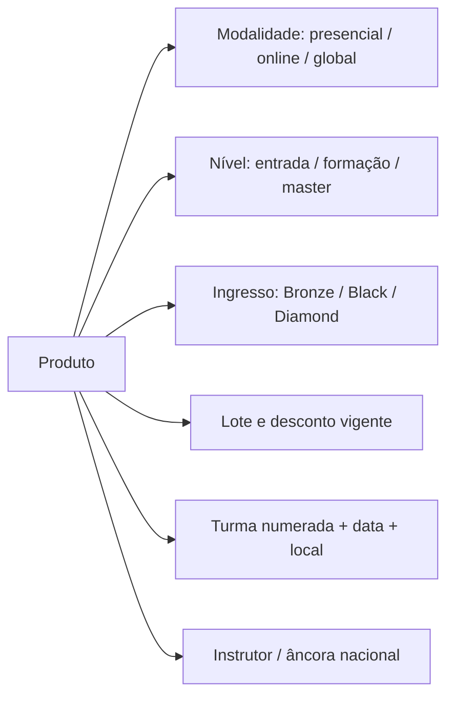

# Catálogo de produtos e treinamentos

> [!info] Por que este é o documento mais útil para features
> Toda modelagem de **produto, turma, matrícula, receita por curso e conversão** depende de saber
> quais são os SKUs reais. Esta é a lista pública consolidada — a lista *praticada em Salvador*
> pode ser um subconjunto (ver [[unidade-salvador-bahia]]).

## Grade Life

| Produto | O que é |
|---|---|
| **Método CIS** | Imersão presencial de inteligência emocional. Carro-chefe. Ver [[metodo-cis-e-coaching-integral-sistemico]] |
| **Formação em Coaching Integral Sistêmico (FCIS)** | Formação profissional de coach. Carga divulgada: +268 h, extensível a 472 h. Certificação FCU |
| **Master Coaching Integral Sistêmico** | Nível avançado da formação |
| **Inteligência Financeira** | Reprogramação da relação com dinheiro. Em Salvador é imersão de 3 dias e o evento âncora local |
| **Formação em Gestão de Perfil Comportamental — CIS Assessment** | Habilita a aplicar/ler a ferramenta. Ver [[cis-assessment]] |
| **Alta Performance em Saúde** | Saúde física, emocional e espiritual |
| **O Poder da Ação (PDA) / PDA Experience** | Treinamento derivado do best-seller |
| **Viva sua Real Identidade (VSRI)** | Linha Camila Vieira; roda em Salvador |
| **Coaching Individual** | Sessões 1:1, vendidas avulso ou em pacote |

## Grade Business

| Produto | O que é |
|---|---|
| **Formação Profissional em Business Coaching — ML5** | Formação de business coach |
| **Formação em Gestão Comportamental para Empresas** | Líderes e gestores usando perfil comportamental |
| **Business High Performance (BHP)** | Conceitos e ferramentas modernas de gestão |
| **Planejamento Estratégico na Prática** | Planejamento estratégico aplicado |
| **Growth — Estratégia de crescimento empresarial** | Redução de custo e aumento de venda |
| **Técnicas Avançadas de Vendas (TAV)** | Escala de vendas; roda em Salvador |
| **Formação de Oradores e Palestrantes** | Oratória para o mundo business |
| **Intercoaching Business** | Prática supervisionada em grupo |
| **Mentoria Business / Masterminds** | Grupos de mentoria recorrentes |

## Pacotes-certificação (agrupam vários cursos)

| Pacote | Carga divulgada | Composição |
|---|---|---|
| **Green Belt** | ~452 h | Life (Método CIS + Formação) + Business (BHP, Oradores, Gestão de Perfil) + Financeiro |
| **Golden Belt** | ~683 h | Tudo do Green + Coaching Executivo Avançado + Master Coaching + Mindfulness |

## Produtos não-curso

- **CIS Assessment** — aplicações avulsas, pacotes e licença para empresas ([[cis-assessment]]).
- **Consultoria / Consultoria Select** — projetos para empresas.
- **Palestras e workshops in company**.
- **Livros, kits e materiais didáticos** — vendidos em loja física na unidade e como parte do ingresso.
  📌 É exatamente o que o hub **Loja/Estoque** do FebraHub trata (apostilas e materiais de depósito).
- **Portfólio Febracis Select** — a franqueadora fala em **37 produtos** disponíveis ao franqueado.

## Eixos de variação que viram campo de cadastro

Um "curso" da Febracis não é uma linha única. Ele varia em pelo menos 6 eixos:

> [!tip] Para o FebraHub
> Modelar produto como **`produto` (SKU conceitual) → `edição/turma` (data, local, instrutor) →
> `categoria de ingresso` (Bronze/Black/Diamond) → `lote/preço praticado`**.
> Sem isso, "receita por curso" mistura coisas que não são comparáveis — o mesmo erro que o
> [`BRIEFING.md`](../BRIEFING.md) já registra ao proibir somar receita de evento com receita de curso.

---
Relacionados: [[metodo-cis-e-coaching-integral-sistemico]] · [[cis-assessment]] · [[funil-comercial-e-jornada-do-aluno]] · [[implicacoes-para-o-febrahub]]
