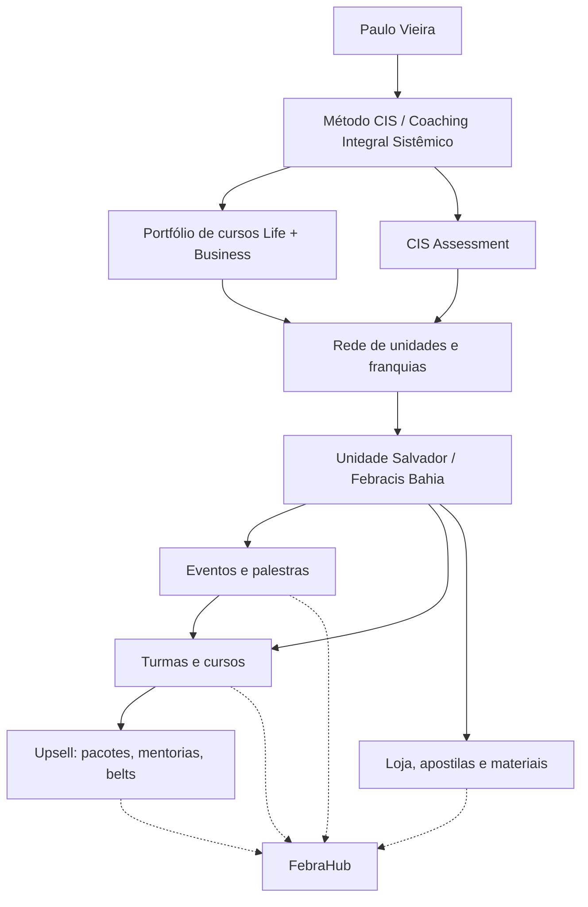

# Febracis — Mapa de Conteúdo

> [!abstract] Por que esta pesquisa existe
> O [[implicacoes-para-o-febrahub|FebraHub]] é o **sistema de gestão (ERP) da unidade Febracis
> Salvador** — comercial, pedagógico, loja, suprimentos, financeiro, fiscal, marketing e
> organização, mais o painel da diretoria.
> Para desenhar features é preciso entender **o que a Febracis vende, para quem, por qual funil e
> com qual operação**. Esta pasta é a base de contexto de negócio — não é documentação técnica.
> O recorte técnico está em [`BRIEFING.md`](../BRIEFING.md) e [`AGENTS.md`](../../AGENTS.md).

> [!warning] Natureza das fontes
> A maior parte dos números (unidades, alunos, faturamento, "maior do mundo") é **autodeclarada**
> em material institucional e releases de imprensa. Trate como *claim de marketing*, não como dado
> auditado. Onde há divergência entre fontes, ela está registrada em [[febracis-visao-geral]].
> O contraponto está em [[reputacao-e-riscos]].

## Trilha de leitura

1. [[febracis-visao-geral]] — o que é, história, números, missão e valores
2. [[paulo-vieira]] — o fundador e o papel dele no produto
3. [[metodo-cis-e-coaching-integral-sistemico]] — a metodologia que sustenta tudo
4. [[catalogo-de-produtos]] — o que efetivamente é vendido
5. [[cis-assessment]] — a ferramenta de perfil comportamental (produto e insumo)
6. [[modelo-de-franquia-e-unidades]] — como a rede se organiza e como a unidade ganha dinheiro
7. [[unidade-salvador-bahia]] — a nossa unidade: quem é, onde fica, o que roda
8. [[funil-comercial-e-jornada-do-aluno]] — do lead ao aluno, e os upsells
9. [[plataformas-e-pagamentos]] — Sympla, CisPay, Salesforce, Clint e afins
10. [[reputacao-e-riscos]] — reclamações, críticas e implicações de compliance
11. [[implicacoes-para-o-febrahub]] — **o que isso vira em feature**
12. [[fontes]] — todas as URLs consultadas

## Mapa mental rápido

## Termos que aparecem o tempo todo

| Termo | Significa |
|---|---|
| **CIS** | Coaching Integral Sistêmico — a metodologia proprietária |
| **Método CIS** | O treinamento-carro-chefe (imersão presencial de vários dias) |
| **Grade Life / Grade Business** | As duas trilhas do catálogo de cursos |
| **Green Belt / Golden Belt** | Pacotes-certificação que agrupam vários cursos |
| **CIS Assessment** | Ferramenta de perfil comportamental (base DISC + Jung) |
| **Febracis Select** | Braço de microfranquia / distribuição de produtos |
| **PDA** | "O Poder da Ação" — livro e treinamento derivado |
| **VSRI** | "Viva sua Real Identidade" — treinamento (linha Camila Vieira) |
| **CisPay** | Braço de pagamentos usado pela rede |

---
Próximo: [[febracis-visao-geral]]
