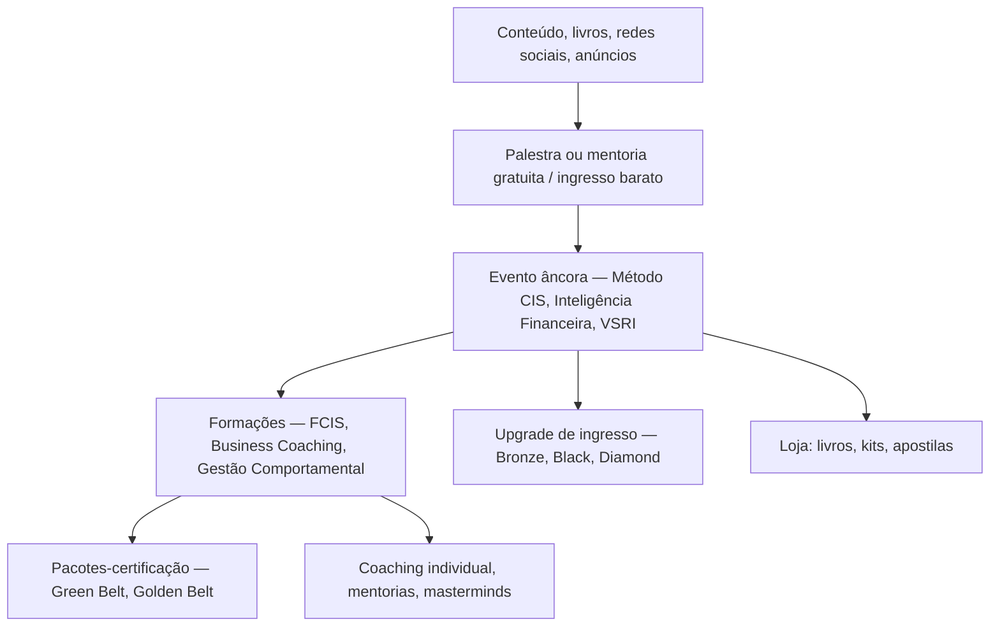

# Funil comercial e jornada do aluno

> [!abstract] A tese do negócio em uma linha
> **Evento enche a sala → sala converte em curso → curso converte em pacote maior.**
> Toda a operação (marketing, comercial, eventos, pedagógico, financeiro) existe para alimentar
> e sustentar essa escada.

## A escada de valor

## Etapas e o que cada uma gera de dado

| Etapa | Instrumento | Dado que nasce aqui |
|---|---|---|
| **Atração** | Livros, redes, tráfego pago, landing pages (`lp.febracis.com`, `go.febracis.com`) | Lead com origem/campanha |
| **Captação** | Palestras e mentorias gratuitas, convites de alunos, indicação | Lead qualificado, presença confirmada × comparecimento real |
| **Evento** | Auditório, ingressos por lote e por categoria | Ingresso vendido, check-in, no-show, receita bruta e líquida |
| **Conversão em sala** | Oferta feita durante o evento | Matrícula, forma de pagamento, desconto concedido |
| **Entrega** | Turmas, módulos, instrutores, salas | Frequência, conclusão, certificação |
| **Expansão** | Upsell para belts, mentorias, coaching 1:1 | Receita recorrente/expansão por aluno |

> [!important] O número que já temos e que fecha a tese
> O [`BRIEFING.md`](../BRIEFING.md) registra **conversão real evento → curso de 2,9%** (e não os 9,1%
> que se acreditava). Isso é a métrica-mãe deste funil: se o custo de encher o auditório não cabe em
> 2,9% de conversão, o evento dá prejuízo mesmo "lotando".

## Práticas comerciais que precisam virar campo, não anedota

Estas são características do modelo (algumas aparecem em [[reputacao-e-riscos]] como reclamação):

1. **Desconto agressivo e por tempo limitado** — "condição relâmpago", 40–50% off.
   → *preço praticado ≠ preço de tabela*, sempre.
2. **Venda dentro da sala**, durante o treinamento, com meta por evento.
   → receita de um evento tem **duas naturezas**: ingresso e matrícula gerada.
3. **Parcelamento longo** (até 12x) e múltiplas formas de pagamento.
   → receita reconhecida ≠ caixa recebido. Inadimplência e chargeback são reais
   (o BRIEFING já cita estornos e chargebacks como perdas nunca contabilizadas).
4. **Convites e indicação de aluno** como canal de captação.
   → origem do lead precisa distinguir *indicação* de *tráfego pago*.
5. **Staff/voluntariado em evento** — prática comum no setor, com implicação trabalhista e de custo.
   ⚠️ Não confirmei documentação pública específica da Febracis sobre isso; tratar como
   **hipótese a validar internamente**, não como fato.

## Sazonalidade

O calendário é **dirigido a eventos**: a receita não é linear no mês, ela salta nas semanas de
evento e de fechamento de turma.

> [!tip] Para o FebraHub
> É por isso que a regra 4 do [`HUB_EXECUTIVO.md`](../HUB_EXECUTIVO.md) — "esperado até hoje" baseado
> na fração histórica realizada, não em meta/30×dia — não é preciosismo: numa operação de eventos,
> a régua linear mente todo mês.

---
Relacionados: [[catalogo-de-produtos]] · [[plataformas-e-pagamentos]] · [[implicacoes-para-o-febrahub]]
