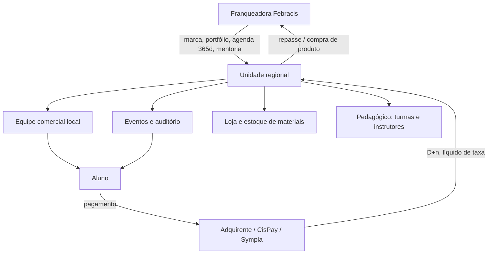

# Modelo de franquia e rede de unidades

## Duas camadas na rede

A rede não é homogênea. Há pelo menos dois tipos de operação sob a marca:

| Camada | O que é | Perfil |
|---|---|---|
| **Unidade / franquia regional** | Opera uma praça inteira: sede física, equipe comercial, eventos em auditório, turmas, loja de materiais | É o caso da **[[unidade-salvador-bahia|Febracis Bahia]]** |
| **Febracis Select (microfranquia)** | Coach individual autorizado a revender o portfólio, operando **home office** | "Notebook, celular e internet" |

> [!important] O FebraHub atende a primeira camada
> Uma unidade regional tem **folha, imóvel, estoque, eventos, contratos com adquirente e fornecedores**.
> Nada disso existe na microfranquia. Toda feature deve assumir o contexto de **operação regional
> multi-setor**, não de coach autônomo.

## O que a franqueadora entrega ao franqueado

- Direito de uso da marca e status de **distribuidor autorizado** dos produtos
- **Portfólio pronto** (~37 produtos) — o franqueado não cria produto
- **Agenda comercial programada de 365 dias**, com ações diárias de venda e marketing
- Mentoria e consultoria diárias; suporte de captação de alunos
- Ferramentas comerciais e de marketing da rede
- Treinamento contínuo e comunidade/networking (Febracis Select)

## Promessa financeira divulgada (microfranquia)

| Claim | Valor |
|---|---|
| Faturamento estimado | **R$ 20 mil+/mês** · **R$ 240 mil+/ano** |
| Casos citados | R$ 10 mil no primeiro módulo; R$ 120 mil em três meses |

> [!warning] Isso é material de venda de franquia
> Serve para entender o **discurso** da rede, não para calibrar meta de unidade regional.
> Meta real de unidade sai do histórico da própria unidade — que é a regra 4 do
> [`HUB_EXECUTIVO.md`](../HUB_EXECUTIVO.md).

## O que isso implica na estrutura de custo da unidade

Uma unidade franqueada tipicamente convive com:

- **Repasse/royalty ou preço de compra** dos produtos junto à franqueadora → o "custo do produto
  vendido" de um curso não é zero, mesmo sendo serviço.
- **Fundo de marketing / campanhas nacionais**.
- **Custo de evento**: auditório, montagem, alimentação (lounge do Black/Diamond), staff, gráfica.
- **Custo financeiro**: taxa de adquirente e de plataforma de ingresso — no caso de Salvador,
  já medidos (**3,10% de maquininha** e **11,5% de Sympla**, conforme [`BRIEFING.md`](../BRIEFING.md)).
- **Estoque de materiais e apostilas** — o hub Loja/Compras do FebraHub.

---
Relacionados: [[unidade-salvador-bahia]] · [[funil-comercial-e-jornada-do-aluno]] · [[plataformas-e-pagamentos]]
